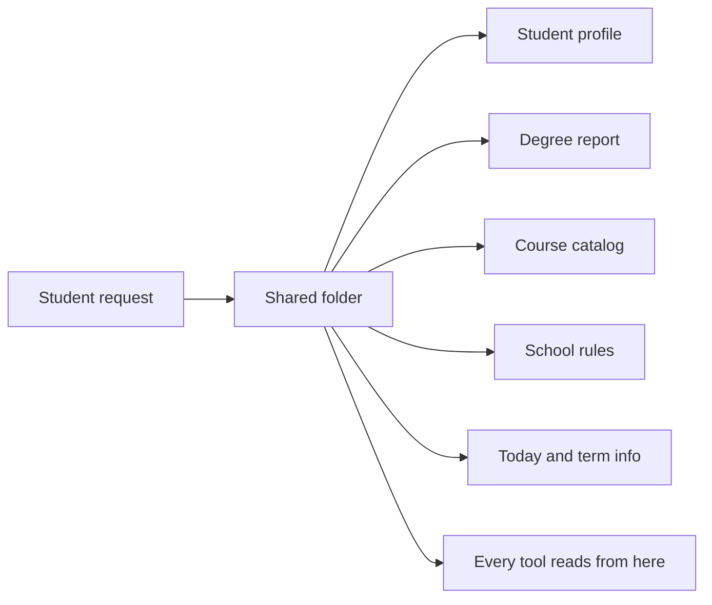

# Session State (`ToolSession`)

> **Source file:** `packages/engine/src/agent/tool.ts` (specifically the `ToolSession` interface)

## TL;DR

When a student sends a message, the system puts together a folder of everything that might be relevant — who the student is, their parsed degree report, the full course catalog, school-specific rules like credit caps, what term it is today, and so on. This folder rides along with every single tool call during the turn, so any tool that needs the student's GPA or the catalog can just reach in and grab it without re-loading. Some tools also drop things into this folder for later use — for example, a tool that proposes changing the student's profile leaves a "pending change" note, and a follow-up confirmation tool reads that note and actually applies it. The folder is fresh for each request and lives only in memory; saving anything permanent is a separate concern.



---

The `ToolSession` is the **shared state object** that flows through every tool invocation in a turn. It is built by the web layer per request, passed into the agent loop, and read (and sometimes mutated) by tools. It is in-memory only — persistence is a separate concern handled by the route layer.

This document enumerates every field on `ToolSession`, what writes it, what reads it, and what shape it has.

---

## 1. The fields

### Identity / profile
- **`student?: StudentProfile`** — the active student. Many tools require this. Built by `apps/web/lib/buildSession.ts` from the DB profile row + DPR-derived fields.
- **`degreeProgressReport?: DegreeProgressReport`** — parsed Albert DPR. Read by `run_full_audit`, `plan_forward_degree`, `what_if_audit`, `get_credit_caps`, `check_overlap`, the forward-schedule subsystem, and most planners. Written by the onboarding/refresh routes after PDF parse. **After the DPR-only pivot this field is mandatory for every personal tool** — see the note below. The DPR is now the *only* source of the student's coursework: the old unofficial-transcript upload path (which once produced a transcript-built profile) has been removed from the product.

#### Which tools require `degreeProgressReport`

After the DPR-only pivot, the **personal tools** (anything that answers a question about the student's own record) refuse in their `validateInput` when `session.degreeProgressReport` is absent, returning a "please upload your DPR" `userMessage`:

| Tool | Guard location |
|---|---|
| `run_full_audit` | `runFullAudit.ts` validateInput (DPR-only; the old authored-rules fallback was removed) |
| `get_academic_standing` | `getAcademicStanding.ts:39-46` — guard was **flipped**: it used to refuse *when* a DPR was loaded; it now refuses *without* one |
| `what_if_audit` | `whatIfAudit.ts:72` |
| `check_overlap` | `checkOverlap.ts:30` |
| `check_transfer_eligibility` | `checkTransferEligibility.ts:53` |

The **impersonal tools** are unchanged and remain DPR-free at the tool level: `search_policy`, `search_courses`, `search_availability`, `get_credit_caps`, `update_profile`, `confirm_profile_update`. (`get_credit_caps` reads the DPR opportunistically when present but does not require it.)

### Catalog data
- **`courses?: Course[]`** — full course catalog with subject/catalog/title/credits/level. Loaded once at server boot from `data/course-catalog/*.json`.
- **`prereqs?: Prerequisite[]`** — prereq groups per course. Loaded with courses.
- **`programs?: Map<string, Program>`** — declared-program rules indexed by `programId`. Used by audit + planner.
- **`schoolConfig?: SchoolConfig | null`** — per-school numeric config (`maxCreditsPerSemester`, `f1FullTimeMinCredits`, `minGraduationCredits`, etc.). Loaded from `data/schools/<school>.json`.

### User intent flags
- **`transferIntent?: boolean`** — true when the user is exploring a transfer. Toggles a system-prompt line and some template applicability checks.
- **`lastUserMessage?: string`** — the latest user message text. Threaded by the route so tools' `validateInput` can apply scope guards (e.g., reject `check_transfer_eligibility` when the message keys on "minor"). When unset, scope guards no-op.

### Mutation staging
- **`pendingMutations?: Map<string, PendingProfileMutation>`** — keyed by stable id. Written by `update_profile.call`. Read + applied + cleared by `confirm_profile_update`. Two-step contract: `update_profile` never mutates the profile directly.
  - A `PendingProfileMutation` carries: `id`, `field` (one of `homeSchool`, `catalogYear`, `declaredPrograms`, `visaStatus`), `before`, `after`, and a free-form `impacts` array the chat layer shows the user before confirmation.
- **`pendingMaterializations?: Map<string, { termCode, sections }>`** — keyed by `proposalId`. Written by `materialize_sections.call` (one entry per conflict-free combination). Read + applied by `confirm_section_combination`. Same two-step contract.

### RAG
- **`rag?: { store, embedder, reranker, templates, confidenceBands? }`** — the policy retrieval stack. The chat route builds this once at boot via `policyRagSetup.ts` and stitches it onto every session. `search_policy` is the only tool that reads it.

### Persistence handles (optional)
- **`profileStore?: ProfileStore`** — when present, `confirm_profile_update` writes the post-mutation profile + an audit row. Failures are swallowed (live session is the source of truth).
- **`scheduleStore?: ScheduleStore`** — when present, `plan_forward_degree` and `confirm_plan_change` persist the schedule (and any preference mutation) after a successful tool call. The route reads `loadLatestSchedule` + `loadPreferences` on session bootstrap. Failures are swallowed.
- **`chatHistoryStore?: ChatHistoryStore`** — present so future tools can read prior turns. The route owns writes (it has the assistant's final text); tool implementations don't write here.

### Temporal
- **`graduationTarget?: string`** — onboarding-stated target term in display form (e.g., `"Spring 2027"`). Read by `plan_forward_degree` as the default for `graduationTermOverride` when the LLM doesn't pass one.

### Forward-schedule outputs (Phase 13+)
- **`forwardSchedule?: ForwardSchedule`** — the solved forward plan. Written by `plan_forward_degree` only when its result state is `"valid-clean"` or `"valid-with-trade-offs"`. Read by `view_forward_plan`, the SSE chat route (for sidebar updates), and the forward-schedule subsystem.
- **`studentDraftPlan?: ForwardSchedule`** — draft schedule whose state is `"infeasible-draft"` or `"student-preferred-invalid-draft"`. These never write to `forwardSchedule` so the agent doesn't endorse an illegal plan.
- **`schedulePreferences?: SchedulePreferences`** — student-driven prefs (load styles, pins, exclusions, summer/J-term opt-in, scheduling preferences). Mutated by `confirm_plan_change`; read by the forward solver. In-memory; lost on session end (unless `scheduleStore` is configured).

### Section materialization side channel
- **`lastMaterializationResult?`** — populated by `materialize_sections.call` as a side effect of staging proposals. Carries:
  - The full `MaterializationResult` (per-course `AvailabilityState`s)
  - `targetTerm: string`
  - `proposals: Array<{ proposalId, sections, weeklyHours }>` (one per conflict-free combination)
  - `computedAt: number` (epoch ms)
  
  The SSE route snapshots `computedAt` before the turn runs and compares afterward to detect whether a fresh result fired this turn — that's the trigger for the `forward_materialization_update` SSE event.

---

## 2. Who writes what

```mermaid
graph LR
    subgraph Route as Web route (apps/web)
        BS[buildSession]
    end
    
    subgraph LoaderBoot as Engine boot
        DL[dataLoader]
        RAGSETUP[policyRagSetup]
    end

    subgraph Tools as Tool calls
        UP[update_profile.call]
        CPU[confirm_profile_update.call]
        PFD[plan_forward_degree.call]
        CPC[confirm_plan_change.call]
        MS[materialize_sections.call]
        CSC[confirm_section_combination.call]
    end

    BS -->|student, graduationTarget,<br/>scheduleStore, profileStore,<br/>chatHistoryStore, lastUserMessage,<br/>transferIntent| ToolSession
    BS -->|degreeProgressReport| ToolSession
    BS -->|forwardSchedule,<br/>schedulePreferences,<br/>studentDraftPlan<br/>from scheduleStore| ToolSession

    DL -->|courses, prereqs,<br/>programs, schoolConfig| ToolSession
    RAGSETUP -->|rag = {store, embedder,<br/>reranker, templates}| ToolSession

    UP -->|pendingMutations[id]| ToolSession
    CPU -->|apply + clear pendingMutations<br/>+ mutate student| ToolSession
    PFD -->|forwardSchedule OR<br/>studentDraftPlan| ToolSession
    CPC -->|schedulePreferences mutation<br/>+ re-solved forwardSchedule| ToolSession
    MS -->|pendingMaterializations[proposalId]<br/>+ lastMaterializationResult| ToolSession
    CSC -->|apply + clear pendingMaterializations<br/>+ pin CRNs into forwardSchedule| ToolSession
```

---

## 3. Who reads what

Most tools read **at minimum** `student` and either `degreeProgressReport` or some combination of `courses` / `prereqs` / `programs` / `schoolConfig`. The full read pattern per tool is in each tool's own doc; some non-obvious cases:

- **`search_policy`** is the only tool that reads `rag`. If `rag` is absent, the tool fails its `validateInput`.
- **`materialize_sections`** reads `schedulePreferences` (to apply scheduling-pref filters), `forwardSchedule` (to identify locked terms), and writes `pendingMaterializations` + `lastMaterializationResult`.
- **`plan_forward_degree`** reads `degreeProgressReport`, `schedulePreferences`, `graduationTarget`, the catalog, and the school config; writes `forwardSchedule` or `studentDraftPlan`.
- **`confirm_section_combination`** reads `pendingMaterializations` to get the chosen combination and `forwardSchedule` to pin CRN/section into the corresponding semester slot.

---

## 4. The `ToolSession` lifecycle inside a turn

```mermaid
sequenceDiagram
    participant Web as buildSession (web)
    participant DB
    participant Loop as Agent Loop
    participant Tool as Tool
    participant Persist as scheduleStore / profileStore

    Web->>DB: load profile, schedule, prefs, chat history
    DB-->>Web: rows
    Web->>Web: assemble ToolSession (in-memory)
    Web->>Loop: pass session
    Loop->>Tool: call(input, { signal, session })
    Tool->>Tool: read fields
    Tool-->>Loop: output (+ side effects on session)
    Loop->>Tool: ... more tools ...
    Loop-->>Web: ChatTurnResult + invocations
    Web->>Persist: optional async writes (schedule, prefs, profile)
    Web->>DB: append messages to chat history
```

The session **is not serialized between turns within the same conversation**. The route layer holds it in memory for the duration of one SSE request, then either lets it go (next request rebuilds) or carries the relevant pieces forward via the DB.

---

## 5. Mutability rules in practice

The interface is not frozen. Tools mutate `session.*` freely. The two-step staging (`pendingMutations`, `pendingMaterializations`) is a **convention**, not a runtime guard — it depends on the tool authors. The validator does not police mutations.

What the system DOES guarantee:

- `forwardSchedule` is only written by `plan_forward_degree` and `confirm_section_combination` (pin), and only on success.
- `studentDraftPlan` is only written by `plan_forward_degree` and only when the plan is infeasible/draft.
- `schedulePreferences` is only mutated via `confirm_plan_change`.
- `student` is only mutated via `confirm_profile_update`.

---

## 6. Why this design

The session-as-bag pattern keeps tools loosely coupled:

- A tool can be unit-tested with a partial `ToolSession` (just the fields it reads).
- New tools can read new fields without forcing every other tool to know about them.
- The web layer is free to construct the session however it wants — from DB, from a request body, from a test fixture.

The trade-off is no compile-time guarantee that a session has the fields a tool needs — that's why every tool has a `validateInput` that returns a `userMessage` on missing data (e.g., `"No student profile loaded. Run onboarding first."`).
