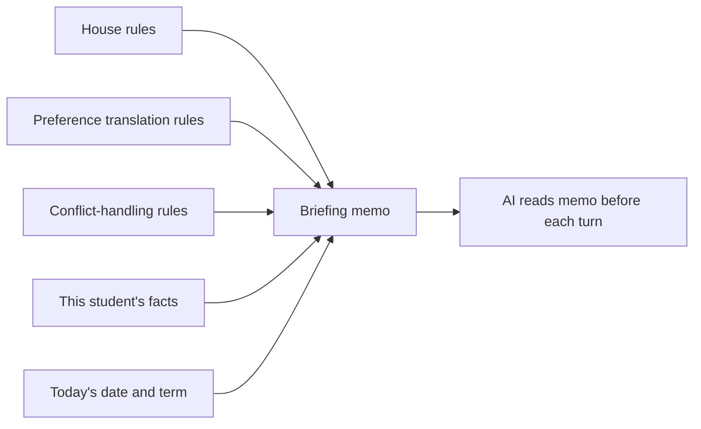
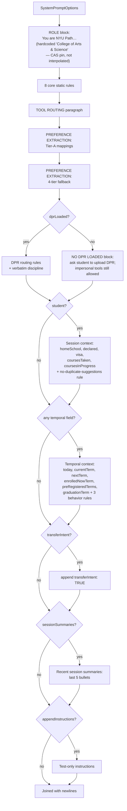

# System Prompt

> **Source file:** `packages/engine/src/agent/systemPrompt.ts`

## TL;DR

Every time the AI is about to think, it gets handed a fresh briefing document — like a memo to a new analyst before each meeting. This memo has three main parts. First come the non-negotiable house rules: never invent numbers, always cite sources, always look up the student's specific data when they say "I" or "my," and so on. Then come rules about how to translate student preferences ("I want fewer math classes") into structured proposals. Then come fallback rules for when student wishes clash with hard requirements. After the always-on rules, the system tacks on facts that change per request — what we know about this specific student, what today's date is, which term they're enrolled in, whether they're thinking about transferring. The result is a custom-tailored instruction sheet that gets the AI grounded before it writes a single word.



---

This module builds the **system prompt** — the long instruction block the LLM sees before every turn. It is constructed fresh per request from a `SystemPromptOptions` bag.

> **Reality check — the ROLE line is CAS-pinned.** The prompt opens with a hardcoded role declaration: `"You are NYU Path, an AI academic adviser for NYU College of Arts & Science."` (`systemPrompt.ts:219-220`). This string is a literal — it does **not** interpolate the student's `homeSchool`. The product is *intended* for all NYU undergraduate schools, and most of the spine is school-agnostic (home school is read from the DPR, `schoolConfig` is loaded per school, the policy RAG corpus covers every undergrad school). But this ROLE line is one of the concrete spots where the system is still pinned to CAS: a Stern or Tandon student is told the adviser is "for NYU College of Arts & Science." De-pinning it is a one-line change (interpolate the home-school label), not a redesign — but as written it is a CAS-first artifact.

The prompt has three sections, assembled in order:

1. **Core static rules** — eight numbered rules that are always present
2. **Preference extraction** — Phase-14 rules about translating natural-language preferences into structured `PlanChangeProposal`s
3. **Decision-#42 4-tier fallback hierarchy** — rules for how to handle hard vs. soft student constraints
4. **Conditional sections** based on options:
   - DPR routing block — an `if`/`else`: the DPR-loaded routing block when `dprLoaded` is truthy, otherwise the `## NO DEGREE PROGRESS REPORT LOADED` block instructing the agent to ask for the DPR
   - Student session context (if `student` provided)
   - Temporal context (if any of `today`/`currentTerm`/`nextTerm`/`enrolledNowTerm`/`graduationTerm`)
   - Transfer-intent flag (if `transferIntent`)
   - Recent session summaries (if any)
   - Test-only append (if `appendInstructions`)

---

## 1. The eight core static rules (always present)

These appear verbatim under the `CORE RULES (mandatory — non-negotiable):` header.

1. **Cardinal Rule.** Every number, course code, requirement status, credit count, GPA, deadline, or rule citation must come from a tool result this turn. Never write a number from training data. Never round. Never paraphrase. If the model catches itself writing a number it can't trace, it must stop and call the tool. (This rule is what the response validator's `checkGrounding` enforces.)

2. **"I / my / me" heuristic.** When the user references themselves, the reply must cite data from the student's DPR via the appropriate tool — not just bulletin policy. Quoting bulletin text without also citing the student's specific numbers is incomplete.

3. **Policy citations.** Quotes must name source document + section. The `search_policy` tool returns these; surface them with the quote. Verbatim quotes from CURATED TEMPLATES should appear exactly as written.

4. **Uncertain policy.** If `search_policy` returns confidence < 0.3 or no matching template, the reply must say "I couldn't find a specific policy on [X]" and recommend an adviser. Do not synthesize.

5. **Missing profile data.** If a tool returns a validation error or data is missing from the profile, ask the student rather than guessing.

6. **Render structured envelope fields faithfully.** Tool results carry envelope fields beyond `data`: `disclaimers`, `suggestedFollowUps`, `anchors`, `coreUaClassifications`, `coreUaRequirements`. When any of these is non-empty, the reply must include its content; disclaimers must be surfaced verbatim. When a tool's envelope reports confidence `low` or `uncertain`, **do not** format any text as a bulletin verbatim quote — surface the disclaimer text and recommend the adviser instead.

7. **Policy gaps.** When `run_full_audit` shows a requirement with generic prose, call `search_policy` once with the program label + requirement keywords. If the first call doesn't surface the right program page, defer to the adviser.

8. **Read-only posture.** The agent cannot take actions in NYU systems. When asked to "sign me up", "register me", "submit my transfer", or "email my adviser", it must plainly refuse — state it doesn't have access, then explain the actual steps the student would take.

Followed by a one-paragraph **TOOL ROUTING** block: each tool's description tells the model when to use it; the validator + each tool's `validateInput` will reject misroutes, so a wrong call is recoverable, but trying to answer without calling a tool when one is needed is not.

---

## 2. Preference extraction (Tier-A modeled mappings)

This is appended verbatim under `## PREFERENCE EXTRACTION — Tier-A modeled mappings (Phase 14)`.

It instructs the model that when the student expresses a scheduling preference, the model must NOT directly mutate the plan. Instead it must:

1. Translate to a `PlanChangeProposal`
2. Call `propose_plan_change`
3. Surface the feasibility + consequences
4. Wait for confirmation
5. Call `confirm_plan_change`

A table of preference → proposal mappings is included:

| Natural-language pattern | `kind` | `payload` shape |
|---|---|---|
| "I want a free / chill / light `<term>`" | `load_style` | `{ term: "<term-code>", value: "light" }` |
| "Make `<term>` heavy / busy / packed" | `load_style` | `{ term: "<term-code>", value: "heavy" }` |
| "Take `<courseId>` in `<term>`" | `pin` | `{ courseId: "<id>", term: "<term-code>" }` |
| "Don't put `<course>` in `<term>`" | `exclude` | `{ courseId: "<id>", term: "<term-code>" }` |
| "I'll consider summer" | `include_summer` | `{ value: true }` |
| "Use J-term" | `include_jterm` | `{ value: true }` |
| "I want to be part-time / drop below 12 credits" | `allow_below_floor` | `{ value: true }` (and surface the OGS RCL warning for F-1) |
| "No Tuesday classes" / "I'd prefer afternoon classes" | `set_scheduling_preference` | `{ value: <SchedulingPreferences fragment> }` |

Term-code resolution rule: use temporal context (`nextTerm`, `graduationTerm`). If the student says a season without a year, default to the nearest future instance of that season relative to `nextTerm`.

Ambiguity rule: ask one clarifying question before calling `propose_plan_change`.

---

## 3. The 4-tier fallback hierarchy

Appended under `## PREFERENCE EXTRACTION — Decision #42 4-tier fallback hierarchy (Phase 14)`.

This is the routing for when a stated preference doesn't fit the mappings above. It begins with a **constraint framing classification**:

- **HARD** — student cites a non-negotiable reason (work, childcare, religious observance, athletic/medical commitment, financial, legal/visa).
- **SOFT** — student states a preference without a non-negotiable reason.

Then the four tiers, applied in order:

| Tier | What | Hard constraints? |
|---|---|---|
| **A** | Factor maps to a modeled `SchedulePreferences` field or `PlanMutation` kind. Extract deterministically. | Yes |
| **B** | Call `compare_plan_alternatives` first. Pick from the returned candidates; explain the pick referencing structured dimensions (balance score, distinct subjects, hard-count). Apply via `confirm_plan_change`. Emit a `LLM_RANKED_ALTERNATIVE` assumption. | Only if at least one candidate satisfies the constraint |
| **C** | No candidate satisfies a hard constraint OR confidence in the mapping is low: ask the student to drop / swap / relax. | Yes |
| **D** | Last resort. SOFT constraints only. Apply a heuristic mapping with the `HEURISTIC_MAPPING` assumption flag (`studentConstraintFraming` MUST be `"soft"` — this is enforced at compile time). | **FORBIDDEN** |

The model is told to surface the chosen tier in plain language so the student knows what reasoning was applied.

---

## 4. The DPR-loaded routing block (conditional)

If `opts.dprLoaded === true`, a block titled `## DEGREE PROGRESS REPORT IS LOADED (mandatory routing rules)` is appended. It establishes:

- The DPR is the source of truth for current state (GPA, credits, requirements, P/F, residency).
- **Routing rules:**
  - GPA / credits / requirements / graduation / P/F / residency questions → `run_full_audit`.
  - For GPA, cumulative credits, and requirement status, `run_full_audit` is the **single source of truth** (it reads the DPR's authoritative numbers). `get_academic_standing` is for probation / SAP standing detail and **also requires the DPR**. `get_credit_caps` returns the school's caps (per-semester ceiling, F-1 floor) from config — call it for credit-load / overload / full-time questions. (This replaces the earlier rule that told the agent *not* to call `get_academic_standing` / `get_credit_caps` when a DPR was loaded.)
  - Semester planning (any phrasing) → `plan_forward_degree`. `plan_semester` is deprecated as of May 2026.
  - After `plan_forward_degree` succeeds and the schedule has any non-locked future semester, **immediately** call `materialize_sections({targetTerm: <first non-locked semester>})` in the same turn (Phase 17 Task E auto-chain). Other future terms stay structural-only because FOSE has no data > ~6 months out.
  - When the user explicitly names a tool, call that tool exactly.
  - Hypothetical plan changes against an existing plan → `propose_plan_change`. Multi-alternative comparisons → `simulate_alternatives` or `compare_plan_alternatives`. `what_if_audit` only for program-level (different major/school) hypotheticals.
  - Applying a proposed change → `confirm_plan_change` with the `pendingMutationId`.
  - Binding a course into a free-elective or pool slot → `bind_free_elective` or `bind_pool_slot`.
  - Getting the live section grid → `materialize_sections`, then `confirm_section_combination` after the student picks.
  - Policy questions (P/F deadline, withdrawal window) → `search_policy` as usual.
- **Verbatim reply discipline:** quote DPR-derived numbers exactly as the audit returned them. Don't paraphrase `3.402` as "around 3.4". Don't round `138 credits` to `~140 credits`. The validator rejects replies that omit DPR-anchored values.

---

## 4b. The no-DPR routing block (conditional — the `else` branch)

`opts.dprLoaded` is a strict `if`/`else`. When it is **falsy**, the prompt appends a block titled `## NO DEGREE PROGRESS REPORT LOADED (mandatory)` instead of the DPR-loaded block above. After the DPR-only pivot the unofficial-transcript upload path is gone, so a session with no DPR has no personal record at all — and every personal tool (`run_full_audit`, `get_academic_standing`, `what_if_audit`, `check_overlap`, `check_transfer_eligibility`) refuses in its own `validateInput`. The block tells the agent:

- For **any** personal/record question (GPA, credits, requirements, academic standing, transfer eligibility, degree planning, what-if audits), do **not** guess or use general knowledge. Tell the student the DPR is needed and ask them to upload it (Albert → Student Center → Academics → Degree Progress Report), then stop.
- It **may** still answer impersonal questions that need no personal data: general policy lookups (`search_policy`), course catalog search (`search_courses`), live section availability (`search_availability`), and the school's credit caps (`get_credit_caps`).
- Never fabricate the student's numbers from training data.

This is the prompt-level mirror of the personal tools' `validateInput` DPR guards — belt-and-suspenders so the agent both explains the upload and the tools enforce it.

---

## 5. Session context block (conditional)

If `opts.student` is provided, a `## Session context (do not fabricate; trust this block)` section appears with:

```
- homeSchool: <value>
- catalogYear: <value>
- declaredPrograms: <list of programType + programId, or "(undeclared)">
- visaStatus: <if present>
- coursesTaken (N): <dedup list of courseIds, capped at 80 with "+X more" overflow note>
- coursesInProgress (<term>): <list of courseIds>
```

When either `coursesTaken` or `coursesInProgress` is non-empty, an extra instruction is appended:

> When suggesting a course (elective, free slot, etc.), NEVER pick one already in `coursesTaken` or `coursesInProgress`. The student can't retake completed courses without an explicit retake intent; suggesting an in-progress course is a planning bug.

This is what stops the agent from recommending a course the student already has.

---

## 6. Temporal context block (conditional)

If any of `today`, `currentTerm`, `nextTerm`, `enrolledNowTerm`, or `graduationTerm` is provided, the `## Temporal context (use these EXACT labels — do not invent semesters)` section appears:

```
- today: <ISO date> (real wall-clock date)
- currentTerm: <e.g. Spring 2026> (the term in session right now per the calendar)
- nextTerm: <e.g. Fall 2026> (when the student says "next semester" / "this fall", they mean THIS term)
- enrolledNowTerm: <only if differs from currentTerm — the DPR's IP-row term>
- preRegisteredTerms: <comma-separated future-term IP rows the student has already registered for>
- graduationTerm: <e.g. Spring 2027> (the term IN WHICH the student graduates — they take their final courses DURING this term)
```

The block ends with three behavior rules:

1. Label a built plan with `nextTerm` (clock-derived), not a guessed year and not the latest IP-row term.
2. "On track to graduate" reasoning compares remaining requirements against terms between `nextTerm` and `graduationTerm`.
3. "Am I currently enrolled in X?" checks the audit's `dprInProgressCourses` for the term matching `currentTerm`, not `preRegisteredTerms`.

---

## 7. Optional flags

- **`transferIntent`** — if true, appends `- transferIntent: TRUE — the student is exploring transferring`.
- **`sessionSummaries`** — if non-empty, appends `## Recent session summaries (for context only — do not cite)` followed by up to the last 5 summaries as bullet points.
- **`appendInstructions`** — test-only escape hatch; appends `## Test-only instructions` followed by the raw string.

---

## 8. Putting the prompt together



---

## 9. What the prompt deliberately doesn't include

- No tool-by-tool routing table for the 22 tools. Each tool's `description` carries its own routing hints; the prompt's `TOOL ROUTING` paragraph just says "read them, decide, the validator will reject misroutes" (the DPR-loaded ROUTING block does carry a handful of explicit per-tool bullets, e.g. `run_full_audit` vs `search_policy` vs `get_program_requirements`).
- No few-shot examples.
- No persona / personality instructions beyond "precise, factual, and helpful".
- No safety / content-policy text.
- No conversation history. History is passed as `priorMessages` separately to the agent loop, not interpolated into the system prompt.

This minimalism is intentional. The prompt is a stable contract; per-tool routing knowledge lives in each tool's description so adding a new tool doesn't require editing the prompt.
