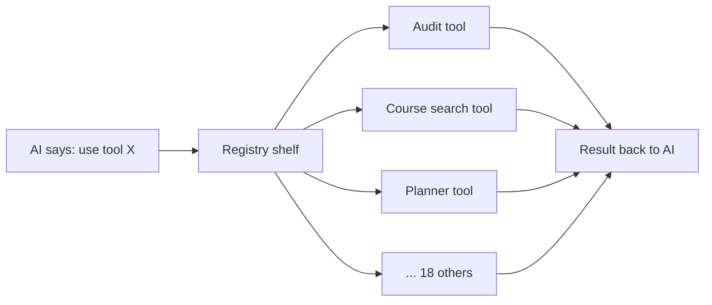

# Tool Registry & Tool Contract

> **Source files:** `packages/engine/src/agent/tool.ts`, `agent/registry.ts`, `tools/index.ts`, `tools/types.ts`

## TL;DR

The AI doesn't actually look up the student's transcript or search the bulletin itself — it asks specialized helpers called "tools" to do those jobs. There are 21 such tools, each one good at one thing (auditing a degree, finding a course, planning a semester, etc.). To keep them consistent, every tool follows the same recipe: it has a name the AI can call, a description telling the AI what it does, a list of inputs it accepts, the actual code that runs, and a way to turn its result into text the AI can read. The "registry" is just a labeled shelf — when the AI says "use the find-a-course tool," the registry grabs the right one off the shelf and runs it. Tools also come in three flavors depending on how strictly the AI must repeat their output: some are quoted verbatim, some are summarized loosely, and some are paraphrased freely.



---

This module defines the abstract contract every agent tool must satisfy, the factory used to build one, the registry that holds them, and the default registry that wires up the 21 live tools.

---

## 1. The `Tool` contract

Every tool implements this shape (generic over a Zod input schema and an output type):

| Field | Type | Purpose |
|---|---|---|
| `name` | string | Stable identifier the model uses (e.g., `run_full_audit`). |
| `description` | string | Free-form description shown to the model. Used directly in `toLLMToolDefs`. |
| `inputSchema` | Zod schema | Validates the model's tool call args before `call` runs. |
| `isReadOnly` | boolean | Defaults to true. Currently no tool sets it to false at runtime — it's a labeling field. |
| `maxResultChars` | number | Cap on the stringified result (default 2000). `summarizeResult` output is truncated to this. |
| `outputMode` | `"template" \| "semi_hardened" \| "synthesis"` | Defaults to `"synthesis"`. See §3. |
| `validateInput?(input, ctx)` | async fn | Optional pre-call check. Returns `{ ok: true }` or `{ ok: false, userMessage }`. The agent loop wraps a failed result as `validation failed: <userMessage>`. |
| `prompt(ctx: { session })` | fn → string | Dynamic per-session prompt block appended to the static description in `toLLMToolDefs`. Lets a tool emit context-aware hints (e.g., "DPR loaded, prefer me"). |
| `call(input, ctx)` | async fn | Runs the tool. Must honor `ctx.signal`. Returns the typed output. |
| `summarizeResult(output)` | fn → string | Produces the model-facing string surfaced as the `tool_result` content. Capped to `maxResultChars`. |
| `extractVerbatim?(output)` | fn → string \| null | Only used when `outputMode === "semi_hardened"`. Returns the text that the validator will require to appear in the final reply. |

`ToolUseContext` carries:
- `signal: AbortSignal` — threaded from the agent loop
- `session: ToolSession` — the per-request state (see [`session-state.md`](session-state.md))

---

## 2. `buildTool` — the factory

`buildTool` produces a fully-typed `Tool` from a literal definition. It applies these defaults:

- `isReadOnly`: `true`
- `maxResultChars`: `2000`
- `outputMode`: `"synthesis"`

It also wraps `summarizeResult` so the final output is automatically truncated:

```
const raw = def.summarizeResult(output);
return raw.length > maxResultChars ? raw.slice(0, maxResultChars) + "…" : raw;
```

No other transformation is applied; the tool author owns input validation, error handling inside `call`, and the structure of `summarizeResult`.

---

## 3. The three output modes

| Mode | Semantics | Validator behavior |
|---|---|---|
| `"synthesis"` (default) | Free LLM synthesis around the tool result. | Only the standard grounding/invocation/caveat rules apply. |
| `"semi_hardened"` | Tool surfaces a `verbatimText` (via `extractVerbatim`) that the reply MUST contain unchanged. | Validator's `checkVerbatim` runs (case-insensitive substring match with numeric-overlap fallback — see [`response-validator.md`](response-validator.md) §6). |
| `"template"` | Bypass the LLM entirely; the template matcher returns the template body directly. Currently used by the pre-loop template path, not by any tool's `outputMode`. | The template's body is the reply verbatim. |

`run_full_audit` and `get_credit_caps` are the two tools that opt into `"semi_hardened"`.

---

## 4. `ToolRegistry` — a name-indexed map

The registry is a tiny class around `Map<string, Tool>`:

- Constructor throws on duplicate names.
- `get(name)` returns the tool or undefined.
- `list()` returns an array of values.
- `has(name)` checks existence.

The agent loop calls `registry.list()` once at the start of each turn to build the LLM's tool list, and `registry.get(toolName)` for each tool call the model issues.

---

## 5. `ALL_NYUPATH_TOOLS` — the wired set

`agent/registry.ts` exports a single array, `ALL_NYUPATH_TOOLS`, containing 21 tools in this fixed order:

```
1.  run_full_audit
2.  check_transfer_eligibility
3.  what_if_audit
4.  search_policy
5.  update_profile
6.  confirm_profile_update
7.  get_credit_caps
8.  search_availability
9.  get_academic_standing
10. check_overlap
11. search_courses
12. plan_forward_degree
13. view_forward_plan
14. propose_plan_change
15. confirm_plan_change
16. simulate_alternatives
17. bind_free_elective
18. bind_pool_slot
19. compare_plan_alternatives
20. materialize_sections
21. confirm_section_combination
```

`plan_semester` is **exported but not in the registry**. The source file is still present and unit-tested, but `ALL_NYUPATH_TOOLS` omits it so the model can never invoke it. See [`deprecated/plan_semester.md`](../deprecated/plan_semester.md) for what it does and why it was removed.

`buildDefaultRegistry()` constructs a fresh `ToolRegistry` from a copy of `ALL_NYUPATH_TOOLS`. The chat route calls this once per session.

---

## 6. How the registry plugs into the loop

```mermaid
sequenceDiagram
    participant Route as /api/chat/v2
    participant Reg as ToolRegistry
    participant Loop as runAgentTurnStreaming
    participant LLM as LLM
    participant Tool as Tool.call

    Route->>Reg: buildDefaultRegistry()
    Reg-->>Route: registry (21 tools)
    Route->>Loop: runAgentTurnStreaming(client, registry, session, msg, opts)
    Loop->>Reg: registry.list()
    Reg-->>Loop: [Tool, …]
    Loop->>Loop: toLLMToolDefs:<br/>name + description + prompt(session) + JSON schema
    Loop->>LLM: complete(system, history, tools=[…])
    LLM-->>Loop: toolCalls = [{ id, name, args }]
    loop each toolCall
        Loop->>Reg: registry.get(tc.name)
        Reg-->>Loop: Tool | undefined
        alt undefined
            Loop->>Loop: emit tool_unsupported, push error tool_result
        else found
            Loop->>Tool: inputSchema.safeParse(tc.args)
            alt Zod fail
                Loop->>Loop: error "validation failed: …"
            else ok
                Loop->>Tool: validateInput(parsed, ctx)
                alt rejected
                    Loop->>Loop: error "validation failed: <userMessage>"
                else accepted
                    Loop->>Tool: call(parsed, ctx)
                    Tool-->>Loop: output
                    Loop->>Tool: summarizeResult(output)
                    Tool-->>Loop: summary
                    alt semi_hardened
                        Loop->>Tool: extractVerbatim(output)
                        Tool-->>Loop: verbatimText | null
                    end
                end
            end
        end
        Loop->>LLM: tool_result message
    end
```

---

## 7. `tools/index.ts` and `tools/types.ts` (legacy compatibility)

`packages/engine/src/tools/` is the **legacy Phase 0 surface**. `tools/index.ts` only re-exports `buildTool`, `getTool`, `listTools`, `registerTool`, and the type aliases `Tool`, `ToolContext`, `ToolDef`, `ValidationResult` from `tools/types.ts`. It exists so `src/index.ts` can keep a stable public type surface for downstream consumers. The live registry is the one in `agent/`.

`tools/types.ts` is the original tool-shape definition from before the agent-tool refactor. Nothing in the runtime path uses it — it's pure type ergonomics for callers that import from the top-level `@nyupath/engine` barrel.

---

## 8. Why the registry is rebuilt per session

The registry is a thin map but it's built per session for a real reason: the tool descriptions (`prompt(ctx: { session })`) are dynamic. They read `session.degreeProgressReport`, `session.student.homeSchool`, `session.forwardSchedule`, etc., to emit context-sensitive hints. A long-lived global registry would baked stale hints in.

The Map itself is constructed quickly (O(N) where N=21), so per-session rebuild has no measurable cost.

---

## 9. What the registry never does

- It does not **execute** tools. That's the agent loop's `executeTool` helper.
- It does not **validate** inputs. Tools do that via `inputSchema` + `validateInput`.
- It does not **persist** anything. Tool side effects on `session` are in-memory; the route layer chooses what to flush to disk after each turn.
- It does not perform **authorization**. Per-user scoping is the web layer's responsibility.
