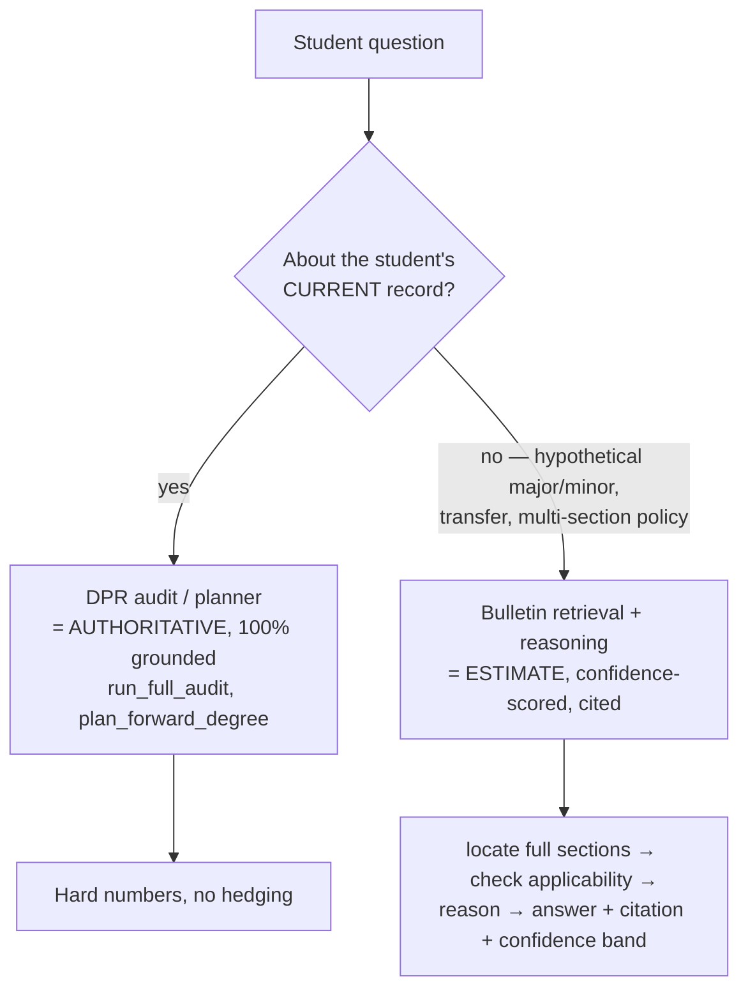
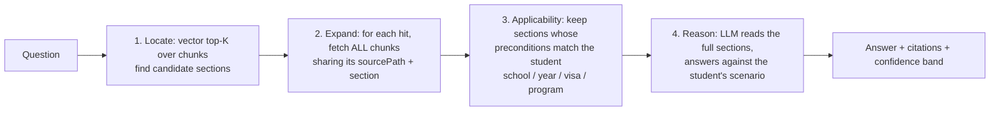
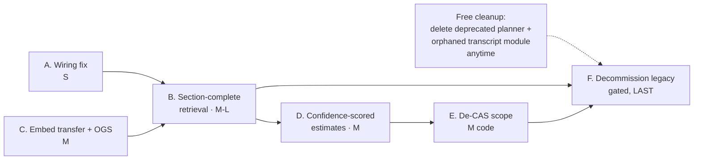

# NYU Path — Improvement Plan

> **Status:** in progress. **Phase A ✅ and Phase B ✅ (core) are implemented and merged**; Phases C–F pending. This plan turns the audit findings into a phased, buildable roadmap. Every "current state" claim below was verified against the code/data during the audit. Effort sizes are rough (S = hours, M = a focused day or two, L = multi-day + ongoing data work). Each shipped phase carries a **Status** callout under its heading.

---

## 0. The problems this plan fixes

From the audit, five concrete gaps:

1. **Wiring bug** — the chat route never loads `session.programs` / `session.courses` / `session.prereqs`, so `check_overlap` always rejects and `what_if_audit`'s authored path is unreachable in production.
2. **Retrieval is fragment-level** — `search_policy` returns the top-5 most-similar ~500-token chunks, not the *full relevant section(s)*. Multi-part policies (caps + exceptions spread across a page) get answered from a partial view. No applicability-filtering step.
3. **Missing corpus coverage** — transfer-requirement pages (`internal-transfer-equivalencies/`) and OGS/visa pages (`ogs/`) are **not embedded**, so they're unsearchable.
4. **Requirements/transfers can't be audited** — the structured rule catalog is 1 program + 1 transfer route; hypothetical major/minor/transfer questions degrade to a disclaimer.
5. **CAS-pinned** — system prompt hardcodes CAS, only 3 school configs exist, several rules use CAS-only defaults; intended scope is all NYU undergrad.

The unifying design shift: **make the agent behave like a human adviser — locate the relevant *full* bulletin section(s), confirm they apply to *this* student, then reason — with an explicit confidence band for anything not 100%-grounded in the DPR.**

---

## 1. The two-tier grounding model (the philosophy to build toward)

Keep a clean line between fact and estimate:

- **Tier 1 (authoritative):** the current-major audit and the forward plan come from NYU's DPR — unchanged, hard-grounded.
- **Tier 2 (estimate):** hypothetical major/minor changes, transfers, and multi-section policy reasoning come from bulletin RAG + LLM reasoning — explicitly labeled as estimates with citations and a confidence band, never presented as audit-grade facts.

---

## 2. Phases (ordered by dependency + value)

### Phase A — Wiring fix: load the catalog into the session  · **Effort: S** · ✅ **DONE**

> **Status: shipped.** Added `apps/web/lib/loadCatalog.ts` (module-cached `getCatalog()` over the engine loaders) and wired `programs`/`courses`/`prereqs` onto the `ToolSession` in `apps/web/app/api/chat/v2/route.ts` (try/catch → null fallback). 3 new tests; web suite green. `check_overlap` and any rule-engine path are no longer dead in production.

**Goal:** stop `check_overlap` rejecting and make any authored rule-engine path reachable.

**What:** in `apps/web/app/api/chat/v2/route.ts` session bootstrap, populate `programs`, `courses`, `prereqs` from the engine's data loaders (same loaders the CLI uses), keyed off the data dir. Thread them onto the `ToolSession`.

**Files:** `apps/web/app/api/chat/v2/route.ts` (+ maybe a small `lib/loadCatalog.ts` helper). Loaders already exist in `packages/engine/src/data/` and `dataLoader.ts`.

**Risk:** low. **Validation:** `check_overlap` returns a real result for a 2-program DPR; existing engine tests still green.

**Note:** this re-enables the *authored* path, but it's still limited by sparse `data/programs/`. The real capability comes from Phase B (RAG). Do this anyway — it's cheap and unblocks `check_overlap`.

---

### Phase B — Section-complete retrieval (the core upgrade)  · **Effort: M–L** · ✅ **DONE (core)**

> **Status: shipped.** `packages/engine/src/rag/sectionRetrieval.ts` adds `reassembleSource` (whole page), `reassembleSection` (whole section), and `locateBestSource` (scope → vector → rerank → pick the best *source*, with a soft `program`/`core_curriculum`/`school_overview` category preference). Two surfaces use them:
> - **B1** — new `get_program_requirements` tool: locate the program's page → return the **entire** reassembled page + a confidence band (high/medium/low from the locate score) + disclaimers when weak. Registered (#5), routed in the system prompt (DPR-loaded + no-DPR branches), UI status verb added. See [tools/get_program_requirements.md](tools/get_program_requirements.md).
> - **B2** — `search_policy` now expands its **top** hit to its full section (the `FULL SECTION` block), additive + budget-guarded. See [tools/search_policy.md](tools/search_policy.md).
>
> 14 new tests; full engine suite shows only the 5 known pre-existing failures; zero new typecheck errors.
>
> **Deferred to later phases:** the "applicability framing" step (#4 below) and the grounding-validator treatment of reasoned conclusions as estimates land in **Phase D** (confidence + validator). Multi-section *gathering* across many headings in one turn (#3) is still bounded by the top-5 fragment limit for non-top sections + the rule-7 "don't re-query" guidance — `get_program_requirements` covers the whole-*page* case; broader multi-section policy gathering is a follow-up.

**Goal:** the agent can locate one or more **full** relevant bulletin sections/pages, not top-5 fragments, and reason over them.

**Design — "locate → expand → (applicability) → reason":**

**What to build:**
1. A **retrieval mode that returns whole structural units.** The corpus already tags every chunk with `sourcePath` + `section` ([rag/chunker.ts], [rag/corpus.ts]). Add a function that, given a chunk hit, reassembles **all chunks of that section** (policy) or **that page** (program requirements), in document order. (Alternatively read the raw `bulletin-raw/.../_index.md` for clean tables.)
2. **Expose it as tool(s):**
   - Extend `search_policy` with a `wholeSection: true` mode (default the new behavior for policy reasoning), OR add a sibling `get_policy_sections(query)` that returns 1–N *full* sections.
   - Add `get_program_requirements(programPageRef)` returning the full reassembled program page (for hypothetical major/minor + transfer reasoning).
3. **Make it multi-section.** Allow the LLM to gather several sections in a turn (relax the system-prompt rule-7 "don't re-query" guidance for this path), and/or return the top-N *sections* (not top-5 chunks).
4. **Applicability framing.** Instruct the model (and/or add a lightweight step) to state, per section, whether it applies to the student's school/year/visa/program before relying on it.

**Files:** `packages/engine/src/rag/policySearch.ts`, `rag/chunker.ts`/`corpus.ts` (section-group helper), `agent/tools/searchPolicy.ts` (+ a new tool file), `agent/systemPrompt.ts` (routing + rule-7 relaxation for the new path), `agent/registry.ts`.

**Risk:** medium — context cost (whole sections are bigger; cap to N sections, prefer section over whole-page), and the grounding validator must treat reasoned conclusions as estimates (see Phase D). **Validation:** a multi-part policy question (e.g. full P/F rules incl. exceptions) returns the complete rule set + citations; a "Stern Finance requirements" query returns the full requirement list.

---

### Phase C — Embed the missing bulletin trees  · **Effort: M**

**Goal:** make transfers and visa policy actually searchable.

**What:** run the existing embed pipeline (`tools/policy-corpus-embed` → `buildCorpus`) over the currently-skipped trees:
- `data/bulletin-raw/internal-transfer-equivalencies/` (9 files) — unblocks transfer requirements via RAG.
- `data/bulletin-raw/ogs/` (160 files) — real F-1/J-1/RCL/CPT/OPT depth (today only a single template + school config cover F-1).
- (Optional) `nyu/` university-wide pages.
- Leave `graduate/` out (undergrad scope). Courses stay in their separate `search_courses` index.

**Files:** `tools/policy-corpus-embed/embed.ts` + `packages/engine/src/rag/corpus.ts` (widen the ingest globs); re-generate `data/policy-corpus/policy_chunks.jsonl` + `.meta.json`. **Also refresh** the stale `parsedDataValidation` snapshot test (it expects 16 curated entries; there are 19).

**Risk:** low–medium (corpus size grows; re-embed cost). **Validation:** `search_policy("internal transfer to Stern requirements")` and an OGS RCL query return real chunks.

---

### Phase D — Confidence-scored estimate output  · **Effort: M**

**Goal:** Tier-2 answers ship as labeled, cited estimates — and the validator treats them as estimates, not ungrounded facts.

**What:**
1. Have the Tier-2 tools (`what_if_audit`, transfer, the new requirements/policy-section tools) return an explicit `confidence` (high/medium/low/uncertain) + citations in their envelope (the envelope already has a `confidence` field). Confidence should reflect retrieval quality + how cleanly the student's courses map to the requirement list.
2. **Validator adjustment:** the grounding check (`responseValidator.ts`) requires numbers to trace to a tool result. A RAG-reasoned "≈5 requirements left" isn't a hard number — so either (a) route these answers through a path the validator recognizes as an estimate (e.g. require an explicit "estimate"/"confidence" disclaimer that satisfies a caveat rule), or (b) add an `estimate` violation-exempt class. Keep the hard grounding for Tier-1 DPR answers.

**Files:** the Tier-2 tool files, `agent/toolEnvelope.ts`, `agent/responseValidator.ts`, `agent/systemPrompt.ts` (estimate-framing rule).

**Risk:** medium — don't weaken Tier-1 grounding. **Validation:** a hypothetical-major answer ships with "estimate + confidence: medium + citation" and passes the validator; a current-major GPA claim still requires a tool result.

---

### Phase E — De-CAS the scope (all NYU undergrad)  · **Effort: M code, small data**

**Goal:** non-CAS students get equal-quality answers, not degraded ones.

**Key correction (DPR-first — supersedes the original "author a config per school" idea).** Most of what `schoolConfig` provides is **already in each student's DPR**, per-student and authoritative: `creditsRequired` (degree total), `cumulativeGpaRequired` (GPA floor), `residencyRequired`, `passFailCapUnits` (P/F career cap), `outsideHomeCapUnits` (cross-school cap), `timeLimitYears`. So the de-CAS effort is mostly **code** (point the cap-readers at the DPR), **not** per-school data authoring. The students bring their own per-school rules in via the DPR they already upload.

**E1 — Point cap-readers at the DPR (code, M):**
- `get_credit_caps` and `creditCapValidator` should read total credits / GPA floor / residency / P/F cap / cross-school cap from the **DPR cumulative block**, not `schoolConfig`. This makes them school-agnostic for free (the DPR is already specialized to the student's school + catalog year).

**E2 — De-hardcode the residue (code, M):**
- System prompt: replace the hardcoded "College of Arts & Science" with the school display name derived from `student.homeSchool` ([systemPrompt.ts:220]).
- `deriveHomeSchool`: surface uncertainty instead of silently defaulting to `"cas"` ([buildSession.ts]).
- The **two genuinely DPR-absent registration constants** the planner needs — **per-semester ceiling (~18)** and **F-1 floor (~12)** — are near-universal across NYU undergrad. Keep them as a **single shared default with sparse per-school overrides** only where a school actually differs. This replaces the per-school config-authoring effort.
- The few remaining policy thresholds (double-counting, dismissal GPA, overload) come from the Phase B RAG when needed — or disappear with the tools that use them in Phase F.

**E3 — Validation (gated):** to *claim* "equally good for school X," test the audit/planner against an X DPR. Real DPRs are PII — so this is gated on obtaining sanitized per-school DPR fixtures. Until then, mark non-CAS support "beta" honestly.

**Files:** `agent/tools/getCreditCaps.ts`, `audit/creditCapValidator.ts`, `systemPrompt.ts`, `buildSession.ts`, a small shared registration-constant default (replaces most of `data/schools/*.json`).

**Risk:** medium — verify the DPR cumulative fields are reliably populated across schools; a DPR that omits a cap field needs a graceful fallback. **Validation:** a non-CAS DPR produces correct caps/standing/plan; the agent introduces itself with the right school.

---

### Phase F — Decommission legacy (gated, LAST)  · **Effort: S–M per removal**

**Goal:** once the DPR-first + RAG paths are proven, remove the superseded *parallel* implementations so there's **one way to do each thing**. This codebase has repeatedly been bitten by dual paths (the legacy planner vs forward-schedule, the two transcript parsers, `schoolConfig` caps vs the DPR) — removing the dead twin prevents future confusion and the "agent falls back to the deprecated path" class of bug.

**Governing principle — strangler-fig.** Build the new path → ship it → prove it in production → *then* delete the old one, each as its own **small, reversible PR tied to its gate**. Redundancy alone is **not** the test: only remove things that are redundant **AND** inferior **AND** already replaced + validated. Never delete a working path before its replacement is live.

**Gated removal checklist:**

| Legacy to remove | Why redundant | Gate before deleting |
|---|---|---|
| Deprecated single-term planner: `semesterPlanner`, `balancedSelector`, `priorityScorer`, `multiSemesterProjector`, `crossProgramPlanner`, the `plan_semester` tool, the `planFeasibility` verifier | Fully superseded by the forward-schedule solver; `plan_semester` is already unregistered | **None — already dead. Can remove early (free cleanup).** |
| Orphaned engine `transcript/` module | Dead, test-only; production uses the DPR parser | None — but needs surgery across ~6 mixed eval-test files |
| Authored rule engine: `degreeAudit`, `ruleEvaluator`, `crossProgramAudit` + authored program JSON (`data/programs/`) + `programLoader` / `catalogYearLoader` | Only live consumers are `check_overlap` (non-functional in prod) + `what_if` authored path (unreachable in prod) + the deprecated planner | After `check_overlap` + `what_if` migrate to RAG/DPR **and** the deprecated planner is gone |
| `schoolConfig` DPR-duplicated fields + their branches in `get_credit_caps` / `creditCapValidator` | The DPR carries these per-student | After Phase E points cap-readers at the DPR |
| `get_academic_standing` + `calculateStanding` + standing thresholds | `run_full_audit` gives DPR standing | After the DPR standing is rich enough (it's only 2 levels today — **enhance first**) |

**MUST KEEP (redundant-looking but load-bearing or Tier-1 — do NOT delete):**
- The **DPR audit** (`run_full_audit` DPR path) — Tier-1, the whole point.
- **`prereqs` / `prereqGraph`** — the *live* forward-schedule solver uses them heavily (102 references).
- **`gpaCalculator.computePoolGpa`** — used by the DPR path for per-program GPA.
- **`schoolConfig` registration constants** (per-semester ceiling + F-1 floor) — the live planner needs them; the DPR doesn't carry them.
- The **deterministic `cas_to_stern` transfer checklist** — for routes that *have* authored data, the deterministic checklist beats a RAG estimate. Keep it as Tier-1; RAG is the Tier-2 fallback for un-authored routes.

**Files:** removals across `planner/`, `audit/`, `transcript/`, `data/programs/`, `data/schools/`, the affected tools + their tests.

**Risk:** medium if done before the gates clear; low if strictly gated. **Validation:** the full test suite is green after each removal, and a `grep` confirms no live consumer was left behind.

---

## 3. Suggested sequencing

- **A** and **C** are independent quick(ish) wins; do them first (A unblocks `check_overlap`; C unblocks transfers/visa for RAG).
- **B** is the centerpiece and depends on the corpus (C helps).
- **D** depends on B (you need the estimates to score).
- **E** is mostly code now (point cap-readers at the DPR); start E2's de-hardcode early so non-CAS stops *breaking*.
- **F** is last and **gated** — each removal waits for its replacement to be live + validated. The one exception: the deprecated planner + orphaned transcript module are already dead and can be removed anytime as a free cleanup.

---

## 4. Hard constraints to set expectations against

- **A hypothetical major-change can never be a 100%-grounded audit.** Only NYU recomputing the DPR for the new major gives audit-grade numbers. Tier-2 is, by nature, a cited estimate with confidence — that's the correct ceiling, not a bug.
- **Scraped requirement tables are imperfect.** Course-equivalences, cross-listings, and AND/OR groups expressed in prose mean confidence should genuinely vary; don't over-claim precision.
- **"Equally good for all schools" is gated on per-school DPR test fixtures** (PII). Code + configs get you most of the way; verification needs data.
- **Don't weaken Tier-1 grounding** while adding Tier-2 estimates — keep the hard "numbers trace to a tool result" rule for current-record answers.

---

## 5. What I'd build first if you greenlight

A thin vertical slice that proves the whole idea end-to-end:
1. **Phase A** (wiring) — cheap, unblocks `check_overlap`.
2. **Phase C** for `internal-transfer-equivalencies` only — embed the transfer pages.
3. **Phase B** minimal — a `get_program_requirements` + section-expanded `search_policy`, wired so "what would I need for a Stern Finance major?" returns the full Stern Finance requirement page + the student's matching courses + a confidence band.
4. **Phase D** minimal — confidence + citation on that one path, validator-exempt as an estimate.

That single slice demonstrates the locate→expand→reason→confidence model on a real cross-school question, after which the rest (more schools, more trees, de-CAS configs) is repetition + data.
