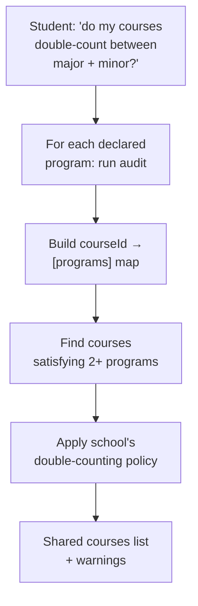
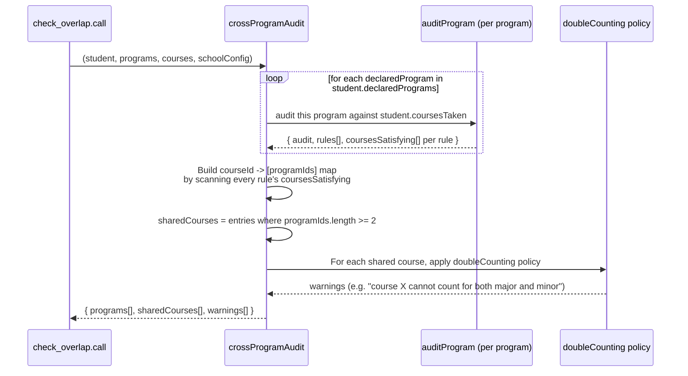

# `check_overlap` — Tool Audit

Source files:
- Tool definition: `packages/engine/src/agent/tools/checkOverlap.ts`
- Audit engine (referenced): `packages/engine/src/audit/crossProgramAudit.ts` (`crossProgramAudit`)
- Tool contract: `packages/engine/src/agent/tool.ts`

---

## TL;DR

When a student asks "if I major in CS and minor in math, does Calc I count for both?", "which of my courses double-count toward my second major?", or "am I over the shared-courses limit?", this tool figures it out. It runs the full audit on every program the student has declared, then looks at which courses end up counted toward two or more of those programs at the same time. It surfaces three things: a quick credit summary for each declared program, the list of shared courses with which programs they overlap into, and any warnings flagged by the home school's double-counting policy (some schools cap how many courses can be shared between a major and a minor, others bar minors from sharing rule-level credit at all). It REQUIRES the student's Albert Degree Progress Report (DPR) to be loaded — overlap is computed against the student's real declared programs and coursework, which come from the DPR — and it also needs the program catalog and the course catalog. If no DPR is loaded it refuses and asks the student to upload one. It's the canonical first call for any double-major / minor / cross-program question.



---

## 1. Purpose

`check_overlap` detects **double-counted courses** between the student's declared programs. Concretely, it answers questions like:

- "If I major in CS and minor in Math, does Calc I count for both?"
- "What courses count toward both my major and my second major?"
- "Am I over the limit on shared courses?"

It returns:
1. The per-program audit summary for each declared program (status + credit progress).
2. The list of **shared courses** — courses that satisfy at least two declared programs.
3. **Double-count warnings** flagged by the home school's `doubleCounting` policy (the `crossProgramAudit` engine emits these based on `schoolConfig`).

This is the canonical first call for any double-major / second-major / minor / cross-program question, per the description's reference to Appendix A rule #4.

The tool is read-only.

---

## 2. Input schema

The input is empty:

```
{ /* no fields */ }
```

Defined at `checkOverlap.ts:24`.

- `isReadOnly` = `true` (line 25).
- `maxResultChars` = 2000 (line 26).
- `outputMode` is the default `"synthesis"`.

---

## 3. Session prerequisites + `validateInput`

`validateInput` (lines 27-44) rejects the call if:

1. **No DPR loaded (or no student)** (`session.degreeProgressReport` or `session.student` missing). Returns: `"I need your Albert Degree Progress Report (DPR) to check cross-program overlap. Please upload your DPR and try again."` This check runs FIRST, before the programs/courses checks — overlap is computed against the student's real declared programs and coursework, which come from the DPR.
2. **Programs catalog missing or empty** (`session.programs` undefined or `size === 0`). Returns: `"Programs catalog not loaded."`
3. **Courses catalog missing or empty** (`session.courses` undefined or `length === 0`). Returns: `"Courses catalog not loaded."`

A student with zero declared programs is NOT rejected here — the tool will still run and the engine will return an empty `programs[]` and empty `sharedCourses[]`.

---

## 4. What it reads

From `ToolSession`:
- `session.degreeProgressReport` — **required** by `validateInput` (the call is refused without it). The DPR is a presence prerequisite here.
- `session.student` — required. Provides `declaredPrograms`, `coursesTaken`, and any other profile fields the audit engine consults.
- `session.programs` — `Map<programId, Program>`. The catalog from which each declared program's rules are resolved.
- `session.courses` — array of `Course` objects (with credits, departments, etc.).
- `session.schoolConfig` — drives the audit semantics, including the `doubleCounting` policy used to emit warnings.

The DPR must be present for the call to proceed, but the overlap computation in `call()` itself still runs against `student.declaredPrograms` + `student.coursesTaken` and the program catalog — it does not read the DPR's contents. Note that the DPR-primary pipeline may leave `coursesTaken` empty (see §10).

---

## 5. Algorithm

`call()` (`checkOverlap.ts:50-69`) delegates everything to the cross-program audit:

```
result = crossProgramAudit(
  session.student,
  session.programs,
  session.courses,
  session.schoolConfig ?? null,
)
```

It then unpacks the result into the tool's output envelope.

### What `crossProgramAudit` does (sequence)



The shared-course detection is purely structural: iterate every audit's `rules[].coursesSatisfying[]`, build an inverted index mapping `courseId → set of programIds whose audit credits that course`, then keep entries with two or more programs.

The double-counting warnings come from the home school's policy (e.g. some schools cap shared courses at N, some bar minors from sharing rule-level credit, etc. — these rules are part of `schoolConfig` and applied by the audit engine, not by this tool).

### Tool-layer repackaging

The tool returns (lines 57-68):

```
{
  declaredPrograms: programs.map(e => ({
    programId:             e.declaration.programId,
    programType:           e.declaration.programType,
    programName:           e.program.name,
    overallStatus:         e.audit.overallStatus,
    totalCreditsCompleted: e.audit.totalCreditsCompleted,
    totalCreditsRequired:  e.audit.totalCreditsRequired,
  })),
  sharedCourses:       result.sharedCourses,    // [{ courseId, programIds: [...] }]
  doubleCountWarnings: result.warnings,         // [{ kind, courseId, programIds, message }]
}
```

The per-program rules and per-rule satisfying courses are **not** surfaced — only the summary fields.

---

## 6. What it returns

```
{
  declaredPrograms: Array<{
    programId:             string,
    programType:           "major" | "minor" | ...,
    programName:           string,
    overallStatus:         string,           // engine-defined status
    totalCreditsCompleted: number,
    totalCreditsRequired:  number
  }>,
  sharedCourses: Array<{
    courseId:    string,
    programIds:  string[]                    // length >= 2
  }>,
  doubleCountWarnings: Array<{
    kind:        string,                     // e.g. "double_count_limit_exceeded"
    courseId:    string,
    programIds:  string[],
    message:     string
  }>
}
```

---

## 7. Envelope behavior

- **`outputMode: "synthesis"`** (default — no `extractVerbatim`). Validator does not pin any specific text.
- **`isReadOnly: true`** (line 25).
- **`maxResultChars` = 2000**; summary truncated above that by the `buildTool` wrapper.
- The tool never writes to `session`.

---

## 8. Summary text format

`summarizeResult` (lines 70-92) emits:

```
PROGRAMS DECLARED: <N>
  <programId> (<programType>): <overallStatus> — <remaining> of <required> credits remaining
  ...
No course is shared across programs.                  # when sharedCourses is empty
                                                       # OR
Shared courses (count toward >1 program):              # when sharedCourses is non-empty
  <courseId> → <programId1> + <programId2>[ + ...]
  ...
Double-count warnings:                                 # when warnings is non-empty
  [<kind>] <courseId> (<programIds joined by ' + '>): <message>
  ...
```

Per-program line uses `remaining = max(0, totalCreditsRequired - totalCreditsCompleted)` so a program already past its credit requirement reads `0 of N credits remaining`.

---

## 9. Interactions with other tools

- **Uses `crossProgramAudit`** — the same engine `what_if_audit` uses for its hypothetical and current audits. Calling `what_if_audit` with `compareWithCurrent: true` effectively runs the same audit `check_overlap` would run, plus a second one against the hypothetical.
- **Schools' `doubleCounting` policy** — surfaced via `schoolConfig`. The audit engine emits warnings based on those rules; this tool surfaces them but doesn't enforce or interpret them itself.
- **`run_full_audit`** — Separate tool that runs the full per-program rule audit. `check_overlap` is the cross-program slice (which courses are shared); `run_full_audit` is the per-program slice (what rules are met / unmet for each).
- **`get_credit_caps`** — Cross-school caps (e.g. non-home-school cap) are returned by `get_credit_caps`. The double-counting policy returned by `check_overlap` is a separate constraint (about courses, not about credit aggregates).

The tool does NOT chain to anything; it has no `suggestedFollowUps`.

---

## 10. Edge cases

- **Student has only one declared program** — Engine runs the single program audit; the inverted index never has 2+ programs per course; `sharedCourses` is empty; `doubleCountWarnings` is empty; the summary shows the single program and `"No course is shared across programs."`
- **Student has zero declared programs** — Engine returns empty arrays; summary reads `PROGRAMS DECLARED: 0` followed by `No course is shared across programs.`
- **A course is in `coursesTaken` but doesn't satisfy any rule in any program** — Doesn't appear in the inverted index. Not flagged as shared (correctly — it's not contributing to any program).
- **A course satisfies a single rule across two programs** — Appears in `sharedCourses` with both `programIds`. Whether it triggers a double-count warning depends entirely on the home school's `doubleCounting` policy (e.g. some schools allow unlimited sharing for cross-program majors but bar it for minors).
- **`session.schoolConfig` is null** — Passed through to `crossProgramAudit`, which falls back to its CAS defaults. The double-counting policy may differ from the actual home school's, but the tool still returns a result.
- **`programs` catalog has no entry for a declared `programId`** — Per the audit engine's handling, that program is typically skipped from the audit. (The exact behavior is encoded in `crossProgramAudit`, not in this tool.)
- **`maxResultChars` exceeded** — The `buildTool` wrapper at `tool.ts:264-268` truncates the summary string with a trailing `…`. The structured output is unaffected.
- **Empty `coursesTaken`** — Every per-program audit shows 0 credits completed; `sharedCourses` is empty; warnings are empty.
- **No DPR loaded** — Rejected by `validateInput` before the programs/courses checks. The tool now REQUIRES a DPR (the call is refused with the "upload your DPR" message). Note that even when the DPR IS present, the DPR-primary pipeline may leave `coursesTaken` empty, in which case the audit will see no satisfying courses and return zero shared courses regardless of actual progress.

---

## Summary

`check_overlap` runs `crossProgramAudit` against the student's currently-declared programs and the home school's policy. It surfaces three pieces: the per-program credit summary, the structurally-detected shared-courses list (every course that satisfies a rule in two or more programs), and the double-counting warnings emitted by the audit engine per the school's `doubleCounting` policy. It is the canonical double-major / minor / cross-program detection tool; it does not handle full per-program rule audits (that is `run_full_audit`'s job).
