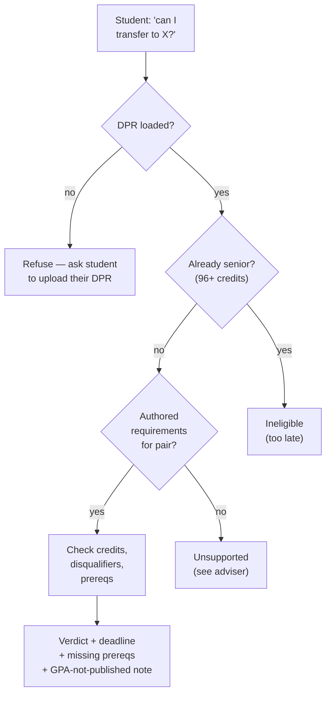
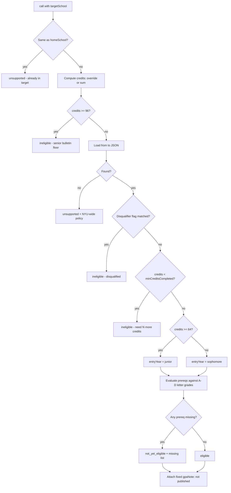

# `check_transfer_eligibility` — Tool Audit

Source files:
- Tool definition: `packages/engine/src/agent/tools/checkTransferEligibility.ts`
- Audit engine: `packages/engine/src/audit/checkTransferEligibility.ts`
- Tool contract: `packages/engine/src/agent/tool.ts`

---

## TL;DR

When a student says "can I transfer from CAS to Stern?", "I want to switch to Tandon — am I eligible?", or "what do I need to move into Tisch?", this tool answers them. It REQUIRES the student's Albert Degree Progress Report (DPR) to be loaded — eligibility keys on their completed credits and prereqs, which come from the DPR — so if no DPR is loaded it refuses and asks the student to upload one. It's strictly about internal NYU transfers — i.e. changing which NYU school grants your degree — not about declaring a cross-school minor or taking a single course at another school (it actually refuses to run for those cases and tells the assistant to use other tools instead). It checks several things in order: are you already past the senior cutoff (96+ credits — NYU doesn't accept transfers in your junior year or later)? Do we even have authored requirements for that from→to pair? Are you blocked by any disqualifier? Do you have enough credits to apply? Have you taken the required prereq courses with passing letter grades (P doesn't count)? Then it spits out a verdict: eligible, not yet eligible, ineligible, or unsupported — plus deadline, accepted terms, what's missing, and a fixed note saying "we don't publish the GPA threshold, ask the school."



> **Reality check — this is a lookup, not a discovery engine.** "Do we have authored requirements for that pair?" means literally: does the file `data/transfers/<homeSchool>_to_<targetSchool>.json` exist? There is **no runtime discovery** — the tool does not crawl the bulletin, query the RAG corpus, or infer requirements; it reads a hand-authored JSON file or it doesn't. As of today `data/transfers/` contains exactly **one** route file — `cas_to_stern.json` (plus the NYU-wide `_nyu_internal_transfer_policy.json`). So **`cas → stern` is the only from→to pair that returns a real prereq/deadline verdict.** Every other destination (CAS→Tandon, CAS→Tisch, Stern→anything, etc.) returns `status: "unsupported"` with the "not yet authored, contact Admissions" message and the NYU-wide policy block. The one thing that *does* fire for unauthored pairs is the senior short-circuit (≥96 credits → `ineligible`), which runs before the file lookup.

---

## 1. Purpose

This tool answers one specific question: **"Can this student switch the NYU school that grants their degree from their current home school to a different NYU school?"**

It is exclusively about **internal transfer** — i.e. changing which NYU school the student belongs to (CAS → Stern, Tandon → CAS, etc.). It is not about:
- Declaring a cross-school minor.
- Taking a course at another NYU school.
- Counting credits earned at another NYU school.

The tool returns a structured decision: one of `unsupported`, `ineligible`, `not_yet_eligible`, or `eligible`. It also tells the student which entry-year requirements apply (sophomore vs junior), what prereqs are met / missing, the application deadline, and a fixed note that the published GPA threshold is unknown.

The tool is read-only and never mutates session state.

---

## 2. Input schema

Pseudo-type:

```
{
  targetSchool: string   // lowercase id, e.g. "stern", "tandon", "tisch"
}
```

Defined at `packages/engine/src/agent/tools/checkTransferEligibility.ts:46-48`.

`maxResultChars` is 2500 (line 49).
`isReadOnly` is the default `true` (from `buildTool` at `tool.ts:258`).
`outputMode` is the default `"synthesis"` (no semi-hardened verbatim contract).

---

## 3. Session prerequisites + `validateInput`

The `validateInput` hook (`checkTransferEligibility.ts:50-96`) rejects the call before `call()` runs if any of the following hold (checked in this order):

1. **No DPR loaded (or no student)** (`session.degreeProgressReport` or `session.student` is missing). Returns: `"I need your Albert Degree Progress Report (DPR) to check transfer eligibility. Please upload your DPR and try again."` This check runs FIRST, before the same-school and scope-guard checks — eligibility keys on the student's completed credits + prereqs, which come from the DPR.
2. **Already in the target school** (`session.student.homeSchool === input.targetSchool`). Returns: `"You're already in <targetSchool>. Did you mean to change major within your current school?"`
3. **Scope mismatch (intent guard).** Reads `session.lastUserMessage` (the latest user message text, threaded by the route layer). Two regex tests run, both case-insensitive:
   - `minorIntent = /\bminor(?:s)?\b/i` AND NOT `transferIntent = /\b(?:transfer|switch (?:to|my)|move to|change (?:my )?school)\b/i` → returns a rejection telling the model the question looks like a minor-declaration question and to use `search_policy` (plus `get_credit_caps` for the non-home-school cap).
   - `courseEnrollIntent = /\b(?:take a course|take courses|enroll in|register for)\b/i` AND NOT `transferIntent` → returns a rejection telling the model to use `search_courses` + `search_policy` for cross-school enrollment.

These guards exist so the tool refuses to run when the user is asking about minors or cross-school enrollment, even though those questions might mention another NYU school by name.

If the latest user message is empty (no `session.lastUserMessage`) the guards no-op and the call proceeds.

---

## 4. What it reads

From `ToolSession` (`tool.ts:39-189`):
- `session.student` — the student profile.
- `session.student.homeSchool` — the current school id.
- `session.student.coursesTaken` — list of `CourseTaken` (id, grade, credits, semester).
- `session.student.transferCourses` — optional array of transfer rows.
- `session.student.genericTransferCredits` — optional pre-aggregated transfer credit total.
- `session.student.flags` — optional array of disqualifier flags (e.g. `"previously_external_transfer"`).
- `session.lastUserMessage` — for the intent guard.
- `session.degreeProgressReport` — **required** by `validateInput` (the call is refused without it). Its `cumulative.creditsUsed` is also passed as `creditsOverride` to the audit engine (`checkTransferEligibility.ts:108-111`). Without this override the audit sums `student.coursesTaken`, which the DPR-primary path leaves empty — producing wrong "you need 32 credits" answers for seniors at 138 credits.

From disk (via the audit engine):
- `loadNyuInternalTransferPolicy()` — NYU-wide internal-transfer policy text (loaded from `data/transfers/`).
- `loadTransferRequirements(homeSchool, targetSchool)` — the specific from→to JSON file with prereqs, deadlines, accepted terms, disqualifiers, equivalency URL, application URL (`audit/checkTransferEligibility.ts:118-133`).

---

## 5. Algorithm

The audit engine at `packages/engine/src/audit/checkTransferEligibility.ts:74-198` runs the following steps in order. The first matching outcome short-circuits.

### Step A — Self-transfer guard

If `student.homeSchool === targetSchool`, return `unsupported` with reason `"Already in <targetSchool>."` and contact `"NYU Office of Undergraduate Admissions"` (lines 79-85). (The tool layer already rejects this in `validateInput`, but the audit engine guards it again for direct callers.)

### Step B — NYU-wide senior-floor short-circuit

Compute `creditsCompletedEarly = creditsOverride ?? sumCreditsCompleted(student)`.

If `creditsCompletedEarly >= 96` (the `SENIOR_FLOOR_CREDITS` constant at line 101), return `ineligible` with a long reason quoting the CAS bulletin §Internal Transfer Students rule that applications are not accepted during or after the junior year. This check fires **before** the school-specific JSON is loaded, so e.g. a CAS senior asking about Tisch (which may not have an authored from→to file) still gets the bulletin-grounded "no" instead of "I don't have data" (lines 86-116).

`sumCreditsCompleted` (lines 202-222):
- Start with `student.genericTransferCredits ?? 0`.
- For each row in `coursesTaken`, **skip** if the grade (uppercased) is one of `F`, `W`, `I`, `NR`, `TR`. Otherwise add `credits ?? 4`.
- If `transferCourses` is set, add each row's `credits`.

### Step C — School-eligibility table load

Call `loadTransferRequirements(homeSchool, targetSchool)`, which simply attempts to read `data/transfers/<homeSchool>_to_<targetSchool>.json`. If the file is absent (i.e. it does not return `ok: true`), return `unsupported` with the NYU-wide policy block attached and reason `"Specific transfer requirements from <home> to <target> are not yet authored in the data set. The general NYU-wide policy applies."` (lines 118-133). The tool never invents requirements for a pair that has no authored JSON file — the philosophy is to defer to the bulletin and an adviser instead.

> **Today there is exactly one authored route file: `cas_to_stern.json`.** Every other `<from>_to_<to>` combination hits this `unsupported` branch. There is no fallback to RAG or to the program corpus here — transfer eligibility is intentionally JSON-table-driven, not retrieval-driven (and note from the RAG docs that `internal-transfer-equivalencies/` is not even embedded into the policy corpus).

### Step D — Disqualifier check

If the loaded `reqs.disqualifiers` is non-empty, iterate each disqualifier id. If the student's `flags` array includes a flag matching that id, return `ineligible` with reason from `reqs.disqualifierReasons[dq]` if present, else `"Disqualified: <dq>."` (lines 138-152). The disqualifier convention: a disqualifier id equals the matching flag name (e.g. flag `"previously_external_transfer"` matches the disqualifier of the same name — this is how Stern blocks previously-external transfers).

### Step E — Credit floor check (lower bound)

Compare `creditsCompleted` (same value as `creditsCompletedEarly`) against `reqs.minCreditsCompleted` (most schools require ~32+ credits). If under the floor, return `ineligible` with reason `"Need <min> credits to apply (you have <current>). Complete your first year first."` and `canApplyAfter = "<gap> more credits"` (lines 159-167).

### Step F — Entry-year selection

Pick the entry year:
- `creditsCompleted >= 64` → `"junior"`
- else → `"sophomore"`

Look up `reqs.entryYearRequirements` for that entry year. If not present, return `unsupported` (lines 170-180).

### Step G — Prereq evaluation

`evaluatePrereqs(student, yearReqs)` at lines 224-253:
1. Build the set of NYU course IDs the student has taken with a **prereq-eligible letter grade**. `PREREQ_VALID_GRADES = { A, A-, B+, B, B-, C+, C, C-, D+, D }`. **P does NOT satisfy a transfer prereq** — only graded A-D enrollments count. W/I/NR/F are also excluded.
2. For each category in `yearReqs.requiredCourseCategories`:
   - Iterate `category.satisfiedBy` (list of accepted course ids).
   - Match each entry using `matchesSatisfiedBy`:
     - If the entry contains `*`, treat the part before the `*` as a wildcard prefix and match any taken id that `startsWith(prefix)`.
     - Otherwise an exact id match.
   - Mark `satisfied: true` if any entry matches. Record the actual taken course id as `courseTaken` (resolved via `resolveTakenMatch` for wildcards). Record the full `satisfiedBy` pool as `candidates`.

### Step H — Verdict

- `missingPrereqs` = `prereqStatus.filter(p => !p.satisfied)`.
- If `missingPrereqs.length === 0`, status is `"eligible"`. Else `"not_yet_eligible"`.

Return shape (lines 186-197) includes `entryYear`, `deadline`, `acceptedTerms`, full `prereqStatus`, `missingPrereqs`, any `notes` from the JSON, the fixed `gpaNote`, and optional `equivalencyUrl` + `applicationUrl`.

### The fixed GPA-not-published rule

For any `"eligible"` / `"not_yet_eligible"` outcome, the engine attaches a hard-coded `gpaNote`:

> **"Minimum GPA for internal transfer is not published. Contact the target school's admissions office."**

This is set at line 194 of `audit/checkTransferEligibility.ts` regardless of the from→to pair. The tool layer surfaces this in the summary so the LLM cannot make up a GPA threshold.

### Flow diagram



---

## 6. What it returns

The audit engine returns one of these shapes (`audit/checkTransferEligibility.ts:37-61`):

```
TransferDecision =
  | { status: "unsupported", reason, contact, nyuWidePolicy? }
  | { status: "ineligible", reason, canApplyAfter?, nyuWidePolicy? }
  | { status: "eligible" | "not_yet_eligible",
      entryYear: "sophomore" | "junior",
      deadline,
      acceptedTerms,
      prereqStatus,
      missingPrereqs,
      notes,
      gpaNote,
      equivalencyUrl?,
      applicationUrl? }
```

`prereqStatus[]` items have shape `{ category, description, satisfied, courseTaken?, candidates }`.

The tool layer returns the engine's decision verbatim (`call()` at line 102).

---

## 7. Envelope behavior

The tool defines no `extractVerbatim`, so the default `"synthesis"` output mode applies. The validator does not enforce any pinned text. The model is expected to use `summarizeResult` content as the grounding source.

The tool is `isReadOnly: true` (default from `buildTool`). It never touches `session` after reading from it.

`maxResultChars` = 2500 — the `summarizeResult` output is truncated above this length by the wrapper in `buildTool` (`tool.ts:264-268`).

---

## 8. Summary text format

`summarizeResult` (`checkTransferEligibility.ts:114-133`) emits one of these layouts depending on `decision.status`:

**unsupported:**
```
TRANSFER UNSUPPORTED: <reason> | Contact: <contact>
```

**ineligible:**
```
TRANSFER INELIGIBLE: <reason>[ (after: <canApplyAfter>)]
```

**eligible / not_yet_eligible:**
```
TRANSFER <STATUS_UPPERCASE> (entry: <entryYear>)
Deadline: <deadline> | Accepted terms: <a, b, ...>
  ✓ <category>: <description> (via <courseTaken>)
  ✗ <category>: <description>
  ...
Missing: <category1>, <category2>
Note: <gpaNote>
```

Each prereq line is prefixed `  ✓ ` or `  ✗ ` depending on `satisfied`. The "Missing: ..." line is omitted when there are no missing prereqs. The final `Note:` always carries the GPA-not-published disclaimer.

---

## 9. Interactions with other tools

- **`run_full_audit` / DPR pipeline.** This tool REQUIRES a `degreeProgressReport` (`validateInput` refuses without one). It extracts `dpr.cumulative.creditsUsed` and feeds it to the audit engine as `creditsOverride`. Without this hand-off, the engine would sum `student.coursesTaken` — which the DPR-primary path leaves empty — and report wrong credit totals (the senior with 138 credits would otherwise appear to have 0).
- **`search_policy`.** When the tool rejects a call as out-of-scope (minor or cross-school-enrollment intent), the rejection message explicitly tells the model to route to `search_policy` (and `get_credit_caps` for the non-home-school cap).
- **`search_courses`.** Same — the cross-school enrollment rejection routes to `search_courses` + `search_policy`.
- **`get_credit_caps`.** The minor-intent rejection tells the model to chain `get_credit_caps` after `search_policy` when the question touches the non-home-school credit cap.

The tool does not chain to anything itself; it has no `suggestedFollowUps` in its returned envelope.

---

## 10. Edge cases

- **No DPR loaded.** Rejected by `validateInput` before the same-school and scope-guard checks (it is the first check). Returns the "upload your DPR" message; `call()` never runs.
- **DPR loaded but `coursesTaken` empty.** Without `creditsOverride`, the audit would sum 0 and return "Need 32 credits to apply" for a senior. The tool layer mitigates this by reading `session.degreeProgressReport.cumulative.creditsUsed` and passing it as `creditsOverride` (lines 108-111).
- **`coursesTaken` rows with non-passing grades.** `F`, `W`, `I`, `NR`, `TR` are excluded from both the credit total (`sumCreditsCompleted`, lines 209-215) and the prereq-eligible set (`PREREQ_VALID_GRADES`, lines 235-237).
- **`P` graded prereq attempts.** A course taken P/F does NOT satisfy a transfer prereq — `P` is not in `PREREQ_VALID_GRADES`. The credit total still counts P-graded credits (since `P` is not in the skip list).
- **Wildcard `satisfiedBy` entries.** `matchesSatisfiedBy` handles entries with `*` by prefix-matching against the student's id set. Used when a prereq accepts any course in a department (e.g. `"MATH-UA *"`).
- **Authored pair missing in dataset.** `loadTransferRequirements` returning `ok: false` produces `status: "unsupported"` with the NYU-wide policy block attached. The senior-floor short-circuit still runs **before** this lookup, so seniors get a deterministic "no" even for unauthored target schools.
- **Entry-year requirements missing for the resolved entry year.** Returns `unsupported`. This happens when a from→to file authors only one entry year (e.g. only sophomore-entry) and the student crosses into the junior tier.
- **Already in target school.** Triple-defended: rejected by `validateInput` in the tool layer; rejected again in the audit engine's first guard.
- **Empty `lastUserMessage`.** The intent guards skip when the string is empty — the call proceeds without the minor / enrollment rejections.
- **`student.flags` undefined.** Disqualifier check defaults to `[]` (line 141) — no spurious disqualification.
- **Disqualifier with no `disqualifierReasons` entry.** Falls back to generic `"Disqualified: <dq>."` message (line 149).
- **`creditsOverride` of 0.** Treated as 0 (because `??` only catches `undefined`). A student with `creditsOverride: 0` gets the "Need <min> credits" ineligible message.
- **Same-major rule.** The system prompt mentions students rarely transfer when their intended major has a close analog in the current school, but the tool does NOT enforce this automatically. The description tells the agent to surface the rule when applicable.

---

## Summary

`check_transfer_eligibility` is a deterministic, bulletin-grounded read-only check. It enforces an NYU-wide senior-credit upper bound (96+ credits) before any school-specific lookup, then runs through a JSON-driven prereq + deadline + disqualifier table for the requested from→to pair. It surfaces a fixed "GPA threshold not published" note on every eligible / not-yet-eligible verdict and refuses to invent thresholds. Two layered intent guards (in `validateInput`) prevent misuse for minor-declaration or cross-school-enrollment questions.
