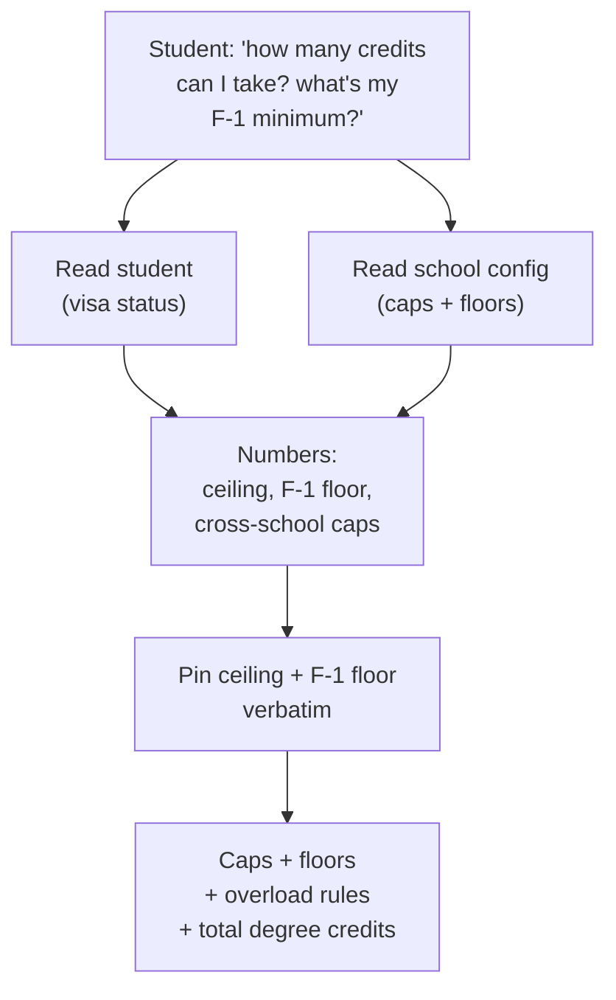
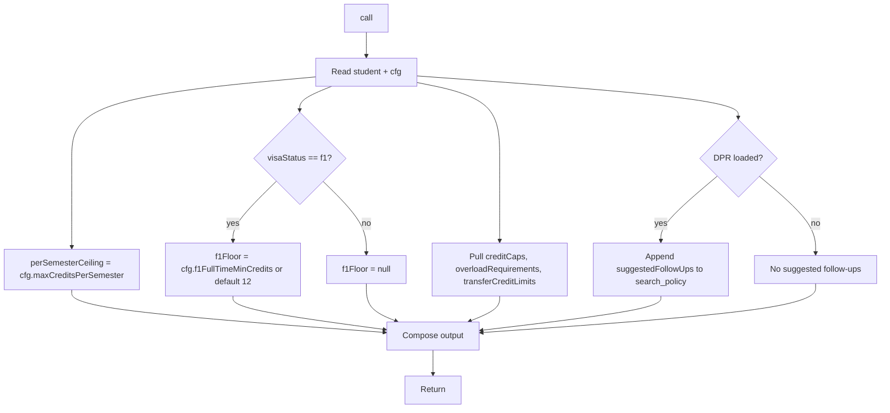

# `get_credit_caps` — Tool Audit

Source files:
- Tool definition: `packages/engine/src/agent/tools/getCreditCaps.ts`
- Cap validator (referenced supporting module): `packages/engine/src/audit/creditCapValidator.ts`
- Tool contract: `packages/engine/src/agent/tool.ts`
- Suggested-follow-up envelope shape: `packages/engine/src/agent/toolEnvelope.ts`

---

## TL;DR

When a student asks "how many credits can I take next semester?", "I'm on an F-1 visa — what's my minimum?", "can I take 4 courses at Tandon if I'm in CAS?", or anything about credit limits, this tool looks up the deterministic numbers from the school's config. It returns the per-semester ceiling (typically 18 for CAS, varies by school), the F-1 full-time floor (typically 12) when the student is on an F-1 visa, all the cross-school caps (e.g. how many non-home-school credits count, online cap, transfer cap), overload requirements, the total degree credit requirement, and the minimum GPA for good standing. The numeric ceiling and F-1 floor are pinned verbatim — the assistant literally cannot paraphrase those numbers. It requires both a loaded student profile and a loaded school config. It's the canonical first call before answering anything about credit load or overload permissions.



---

## 1. Purpose

`get_credit_caps` is a pure data-lookup helper. It returns:

1. The home school's **per-semester credit ceiling** (the maximum a student can register in one term without an overload petition).
2. The **F-1 full-time floor** (the per-semester minimum for F-1 visa holders), when applicable.
3. The home school's **cross-school credit caps** (e.g. non-home-school cap, online cap, transfer cap, advanced-standing cap), drawn from `schoolConfig.creditCaps`.
4. **Overload requirements** (any school-specific rules about how to exceed the ceiling).
5. **Transfer credit limits** (`schoolConfig.transferCreditLimits`).
6. **Total degree credit requirement** and **overall GPA floor**.

The tool has no LLM dependency, no chaining, no profile mutation. It is the canonical first call before answering any question about credit load, overload permissions, or full-time / part-time status.

When the DPR is loaded, the tool additionally attaches a `suggestedFollowUps` array pointing to `search_policy` for the bulletin's narrative coverage of those numbers.

The tool runs in **semi-hardened output mode** — the per-semester ceiling and the F-1 floor must appear verbatim in the LLM's reply.

---

## 2. Input schema

The input is empty:

```
{ /* no fields */ }
```

Defined at `getCreditCaps.ts:32`. Everything the tool needs comes from `session.student` + `session.schoolConfig`.

- `isReadOnly` = `true` (line 33).
- `maxResultChars` = 1500 (line 34).
- `outputMode` = `"semi_hardened"` (line 37).

---

## 3. Session prerequisites + `validateInput`

`validateInput` (lines 38-48) rejects the call if:

1. **No student loaded** (`session.student` missing). Returns: `"No student profile loaded."`
2. **No school config loaded** (`session.schoolConfig` missing). Returns: `"School config not loaded."`

Notably, the validator **does NOT reject when the DPR is loaded** — the tool always runs whether or not the DPR is present. (An earlier behavior rejected when the DPR was loaded, which produced contradictory reasoning iterations; the current behavior keeps the tool running and instead attaches a `suggestedFollowUps` pointing to `search_policy`.)

---

## 4. What it reads

From `ToolSession`:
- `session.student` — used for `visaStatus` only.
- `session.schoolConfig` (`cfg`) — the source of truth for every cap returned. Specifically reads:
  - `cfg.schoolId`
  - `cfg.name`
  - `cfg.maxCreditsPerSemester` — per-semester ceiling. Nullable.
  - `cfg.overloadRequirements` — array; defaults to `[]` if missing.
  - `cfg.creditCaps` — array of `{ type, maxCredits }` rows (e.g. `non_home_school`, `online`, `transfer`, `advanced_standing`). Defaults to `[]`.
  - `cfg.transferCreditLimits` — defaults to `null`.
  - `cfg.totalCreditsRequired` — total degree-credit requirement. Nullable.
  - `cfg.overallGpaMin` — minimum cumulative GPA for good standing.
  - `cfg.f1FullTimeMinCredits` — the F-1 full-time floor; if missing, the tool falls back to a default.
- `session.degreeProgressReport` — only checked for presence (to decide whether to attach the `suggestedFollowUps` row).

### F-1 default constant

`DEFAULT_F1_FULLTIME_MIN_CREDITS = 12` (`getCreditCaps.ts:22`). Used as the fallback when `cfg.f1FullTimeMinCredits` is undefined.

This default is **only consulted** when `student.visaStatus === "f1"`. For non-F-1 students the `f1FullTimeFloor` field in the output is set to `null` regardless of what's in the config.

---

## 5. Algorithm

`call()` (lines 53-103) runs five steps:

### Step 1 — Read inputs

```
student = session.student
cfg = session.schoolConfig
isF1 = student.visaStatus === "f1"
```

### Step 2 — Read fields with null/array defaults

```
perSemesterCeiling   = cfg.maxCreditsPerSemester ?? null
overloadRequirements = cfg.overloadRequirements  ?? []
creditCaps           = cfg.creditCaps            ?? []
transferCreditLimits = cfg.transferCreditLimits  ?? null
```

### Step 3 — Resolve F-1 floor

```
f1FullTimeFloor =
  isF1
    ? (cfg.f1FullTimeMinCredits ?? DEFAULT_F1_FULLTIME_MIN_CREDITS)  // typically 12
    : null
```

### Step 4 — Compose the result object

```
{
  schoolId:              cfg.schoolId,
  schoolName:            cfg.name,
  perSemesterCeiling:    number | null,
  f1FullTimeFloor:       number | null,
  visaStatus:            student.visaStatus ?? "domestic",
  overloadRequirements:  [...],
  crossSchoolCaps:       cfg.creditCaps ?? [],
  transferCreditLimits:  cfg.transferCreditLimits ?? null,
  totalCreditsRequired:  cfg.totalCreditsRequired,
  overallGpaMin:         cfg.overallGpaMin,
  suggestedFollowUps?:   SuggestedFollowUp[]   // only attached when DPR is loaded
}
```

### Step 5 — DPR-loaded follow-up

If `session.degreeProgressReport` is truthy, append exactly one suggested follow-up (lines 93-101):

```
suggestedFollowUps = [{
  tool: "search_policy",
  args: { query: "F-1 full-time minimum credit-load policy" },
  why:  "Bulletin + OGS policy text covers F-1 minimum, RCL, and per-semester ceiling questions in detail. This tool returned the numeric caps; search_policy provides the policy reasoning."
}]
```

When the DPR is not loaded, no `suggestedFollowUps` field is set.

### Flow diagram



---

## 6. What it returns

```
{
  schoolId:              string,
  schoolName:            string,
  perSemesterCeiling:    number | null,
  f1FullTimeFloor:       number | null,
  visaStatus:            string,             // "f1" | "domestic" | ...
  overloadRequirements:  Array<...>,         // structure mirrors schoolConfig
  crossSchoolCaps:       Array<{
                           type: "non_home_school" | "online" | "transfer" | "advanced_standing" | ...,
                           maxCredits: number
                         }>,
  transferCreditLimits:  object | null,
  totalCreditsRequired:  number | null,
  overallGpaMin:         number,
  suggestedFollowUps?:   Array<{ tool, args, why }>
}
```

The `crossSchoolCaps` array surfaces every cap defined in `schoolConfig.creditCaps` regardless of type — including the non-home-school cap, online cap, transfer cap, advanced-standing cap. The `creditCapValidator.ts` module (a separate audit-time module) treats these same cap types as upper bounds when checking actual student credit usage (e.g. `nonHomeSchoolMax`, `onlineMax`, `transferMax`, `advancedStandingMax` at `creditCapValidator.ts:121-132`), so the numbers this tool returns are the same numbers the audit pipeline enforces.

---

## 7. Envelope behavior

- **`outputMode: "semi_hardened"`** (line 37). The validator pins the strings returned by `extractVerbatim`.
- **`extractVerbatim`** (lines 137-150) composes one or two fragments:
  - If `perSemesterCeiling !== null`: `"<schoolName> per-semester ceiling: <N> credits."`
  - If `f1FullTimeFloor !== null`: `"F-1 full-time floor: <N> credits per semester."`
  - Joined with `" "`. Returns `null` if both are absent (no pinned text).
- **`isReadOnly: true`** (default for `buildTool`, plus explicitly `true` on line 33).
- **`maxResultChars` = 1500**; `summarizeResult` truncated above that by the `buildTool` wrapper.
- The tool never writes to `session`.

### Verbatim text — exact format

When both numbers are present, the validator pins the concatenated string:

> `"<schoolName> per-semester ceiling: <N> credits. F-1 full-time floor: <M> credits per semester."`

When only the ceiling is present:

> `"<schoolName> per-semester ceiling: <N> credits."`

When only the F-1 floor is present:

> `"F-1 full-time floor: <N> credits per semester."`

The LLM's reply must include this string unchanged. Synthesis around it is allowed; the pinned text itself cannot be reworded.

---

## 8. Summary text format

`summarizeResult` (lines 105-132) emits:

```
SCHOOL: <schoolName> (<schoolId>)
Per-semester ceiling: <N> credits           # OR: "Per-semester ceiling: not published — confirm with adviser"
F-1 full-time floor: <N> credits/semester (visaStatus=<v>)   # only when f1FullTimeFloor !== null
Overload requirement: <JSON of each row>    # one line per overloadRequirement
Credit cap (<type>): max <N> credits        # one line per crossSchoolCap
Transfer credit limits: <JSON>              # only when transferCreditLimits is set
Degree total: <N> credits required          # only when totalCreditsRequired !== null
Overall GPA min: <N>
```

Overload requirements and transfer limits are rendered with `JSON.stringify` — the model gets the raw structured shape.

---

## 9. Interactions with other tools

- **`search_policy`** — Auto-suggested as a follow-up when the DPR is loaded. The argument is the literal string `"F-1 full-time minimum credit-load policy"`. The reasoning hint says the bulletin and OGS text cover the *policy* detail; this tool only returns the numbers.
- **`get_academic_standing`** — The system-prompt routing pair (per Appendix A rule #5 referenced in the tool's description): "before discussing CREDIT COUNTS, GPA, GRADUATION PROGRESS, or SEMESTER PLANNING, call at minimum: get_academic_standing → get_credit_caps". This tool is the second in that chain.
- **`creditCapValidator.ts` (audit pipeline)** — Not a tool, but the same cap types this tool returns (`non_home_school`, `online`, `transfer`, `advanced_standing`) are enforced by `validateCreditCaps` against actual student credit usage. So the numbers surfaced here match the numbers the run-full audit will use as upper bounds.
- **`plan_semester` / `plan_forward_degree`** — Not direct callers, but consume the same per-semester ceiling and F-1 floor when computing valid semester loads.

The tool does NOT chain to any other tool itself beyond the optional `suggestedFollowUps` row.

---

## 10. Edge cases

- **`cfg.maxCreditsPerSemester` undefined** — `perSemesterCeiling` is `null`. Summary line becomes `"Per-semester ceiling: not published — confirm with adviser"`. Verbatim text omits the ceiling fragment.
- **Non-F-1 student** — `f1FullTimeFloor` is set to `null` regardless of what `cfg.f1FullTimeMinCredits` is. The F-1 line is omitted from both the summary and the verbatim text.
- **`student.visaStatus` undefined** — Output `visaStatus` defaults to `"domestic"`. F-1 floor stays `null`.
- **F-1 student, no `cfg.f1FullTimeMinCredits`** — Falls back to `DEFAULT_F1_FULLTIME_MIN_CREDITS = 12`.
- **No DPR loaded** — No `suggestedFollowUps` is attached. The tool still returns the full data shape.
- **Empty `cfg.creditCaps`** — `crossSchoolCaps` is `[]`. No cap lines in the summary.
- **No `cfg.overloadRequirements`** — Defaults to `[]`. No "Overload requirement:" lines in the summary.
- **No `cfg.transferCreditLimits`** — Defaults to `null`. The "Transfer credit limits:" line is omitted from the summary.
- **`cfg.totalCreditsRequired` null** — The "Degree total" line is omitted from the summary; the structured output still carries `null`.
- **Both `perSemesterCeiling` and `f1FullTimeFloor` are null** — `extractVerbatim` returns `null`, which disables the semi-hardened pin for this call (the validator has no required text). The reply falls back to free synthesis grounded in `summarizeResult`.
- **No `student` or no `schoolConfig`** — Rejected by `validateInput` with a user-facing message; `call()` never runs.

---

## Summary

`get_credit_caps` is a deterministic, zero-side-effect data lookup that surfaces the home school's per-semester ceiling, the F-1 full-time floor (when the student is F-1), all cross-school credit caps in `schoolConfig.creditCaps` (non-home-school, online, transfer, advanced-standing), overload requirements, transfer credit limits, total degree credits, and the overall GPA floor. The per-semester ceiling and F-1 floor are pinned as verbatim text via `extractVerbatim` so the LLM cannot paraphrase or mis-state those numeric facts. When the DPR is loaded, the tool attaches a single suggested follow-up to `search_policy` for the bulletin's narrative coverage.
