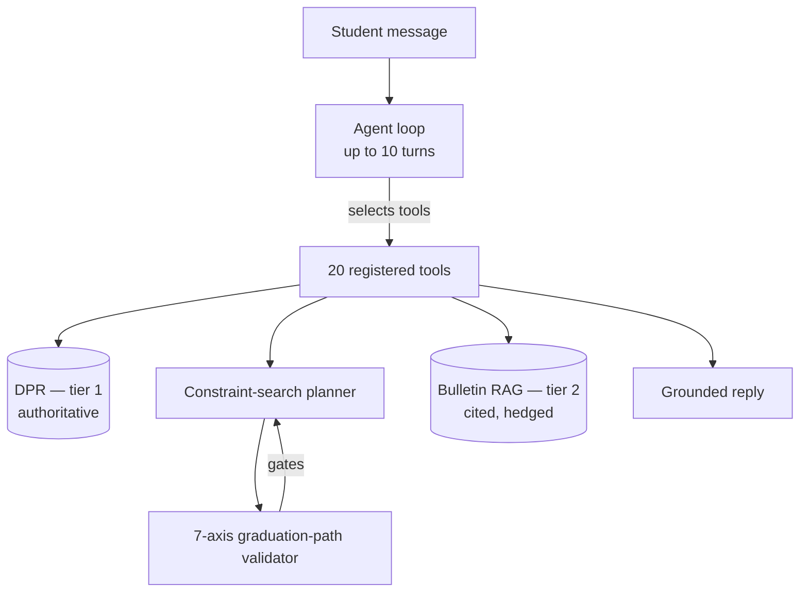

# NYU Path

> Last verified against code: 2026-06-10 (post planning-engine rebuild, PRs #35-#41).

**A chat advisor for every NYU undergraduate.** NYU Path answers degree-progress, planning, and policy questions in plain language for students across all 11 undergraduate schools. The LLM is an **orchestrator, not a truth source**: every number (credits, GPA, graduation progress) comes from a deterministic tool or the student's own Degree Progress Report, never from free generation.

---

## What it does

NYU Path is **DPR-first**. The authoritative source of truth (tier 1) is the student's NYU **Degree Progress Report (DPR)** — the official Albert audit. Personalized answers are computed from the parsed DPR, not from hand-authored rule files.

- **Degree audit** — Reads the student's DPR and reports progress against their declared programs: requirements met/unmet, credits, thresholds, double-counting.
- **Forward planning** — Builds a term-by-term plan to graduation using a constraint-search planner (prerequisites, credit caps, F-1 visa load, graduation target) and validates it with a 7-axis graduation-path validator.
- **What-if analysis** — Re-runs an audit or a plan against a program the student is considering but has not declared.
- **Policy lookup** — Answers policy questions (P/F, credit caps, transfer credit, AP/IB) from the NYU Bulletin via retrieval. This is the **cited, hedged tier 2**: answers are quoted "per the bulletin," never presented as a personalized computation.

**No DPR, no personalized answer.** If a student has not provided a DPR, the personalized tools (audit, plan, what-if) hard-refuse in `validateInput` rather than guess. Policy lookup still works.

## Architecture in brief



- **Agent loop** (`packages/engine/src/agent/agentLoop.ts`) — runs the model with a tool registry, up to 10 turns by default, returning a final reply or a terminal status (`max_turns`, fallback, etc.). No streaming in the engine layer; the web app streams over this.
- **Tools** (`packages/engine/src/agent/registry.ts`) — exactly **20** live tools: `run_full_audit`, `what_if_audit`, `search_policy`, `get_program_requirements`, `update_profile`, `confirm_profile_update`, `get_credit_caps`, `search_availability`, `get_academic_standing`, `search_courses`, `plan_forward_degree`, `view_forward_plan`, `propose_plan_change`, `confirm_plan_change`, `simulate_alternatives`, `compare_plan_alternatives`, `bind_free_elective`, `bind_pool_slot`, `materialize_sections`, `confirm_section_combination`.
- **Constraint-search planner** (`packages/engine/src/agent/forwardSchedule/`) — `solveForwardSchedule` runs `buildConstraintContext` → `findFirstValidPlan` (feasibility-first backtracking search) → `localImprove` → `materializePlan`. Diverse alternatives come from `findDiverseValidPlans`. There is **no greedy solver** anymore.
- **7-axis validator** (`forwardSchedule/graduationPathValidator.ts`) — `runGraduationPathValidator` is the authoritative gate (requirement groups, pool slots, total credits, thresholds, visa, explicit assumptions, graduation target). It is routed through `finalizeForwardSchedule` on the build, propose, confirm, and simulate paths.
- **Bulletin RAG** (`packages/engine/src/rag/`) — chunked NYU Bulletin + policy corpus, embedded and reranked (Cohere), scope-filtered by the student's school. Strictly tier 2.

## Models

Default primary model is **`claude-sonnet-4-6`** (override via `NYUPATH_PRIMARY_MODEL`); fallback is **`gpt-4.1-mini`** (override via `NYUPATH_FALLBACK_PROVIDER` / `NYUPATH_FALLBACK_MODEL`). See [`Docs/reference/MODEL_SELECTION.md`](Docs/reference/MODEL_SELECTION.md).

## Monorepo layout

```
nyupath/
├── apps/
│   └── web/                # Next.js app: chat route, plan-action APIs, Drizzle DB, auth
├── packages/
│   ├── engine/             # Core logic
│   │   └── src/
│   │       ├── agent/      # Agent loop, tool registry, tools, system prompt, forwardSchedule/ (planner + validator)
│   │       ├── dpr/        # DPR parser + audit projection (tier 1, authoritative)
│   │       ├── rag/        # Bulletin/policy retrieval (tier 2, cited)
│   │       ├── audit/      # Authored-rule audit helpers
│   │       ├── api/        # NYU class-search (FOSE) client
│   │       ├── persistence/ provenance/ observability/
│   │       └── data/       # School / program / catalog loaders
│   └── shared/             # Shared types (StudentProfile, grades, etc.)
├── data/
│   ├── schools/            # 11 per-school config JSONs (cas, stern, tandon, …)
│   ├── programs/           # Authored program requirement JSONs
│   ├── course-catalog/     # Course descriptions + embeddings
│   ├── policy-corpus/      # Policy chunks + embeddings
│   └── bulletin-raw/       # Raw NYU Bulletin scrape (source for the parser)
├── tools/                  # Offline pipelines: bulletin scrape/parse, embed, cohort eval, FOSE recorder
├── evals/                  # Model bakeoff + golden/cohort eval sets and results
└── Docs/                   # All project documentation (start at Docs/README.md)
```

## Running it

Prerequisites: Node.js ≥ 18 and pnpm.

```bash
pnpm install                # install all workspace deps
npx vitest run              # run the test suite (1675 pass / 9 env-gated skips)
pnpm -r build               # build all packages

# Web app (chat UI)
cd apps/web && pnpm dev     # Next.js dev server
```

Create `.env.local` (repo root and/or `apps/web`) with the keys you need:

| Key | Purpose |
|-----|---------|
| `ANTHROPIC_API_KEY` | Primary model (`claude-sonnet-4-6`) |
| `OPENAI_API_KEY` | Fallback model + embeddings |
| `COHERE_API_KEY` | RAG reranker |
| `DATABASE_URL` | Postgres/Neon (web persistence) |
| `RESEND_API_KEY` | Email (optional) |

## Status

The **planning-engine rebuild (Phases 0–2)** is complete and merged to `main` (PRs #35–#41, June 2026). This replaced the old greedy planner with feasibility-first constraint search, consolidated the duplicate planning paths, and made the 7-axis validator the single authoritative gate. **Phase 3 — the advisor layer** (richer conversational planning over the rebuilt engine) is next.

## Documentation

All design docs, specs, plans, audits, and per-subsystem references live in **[`Docs/`](Docs/)** — start at [`Docs/README.md`](Docs/README.md). The canonical rebuild design is [`Docs/specs/2026-06-05-planning-engine-rebuild-design.md`](Docs/specs/2026-06-05-planning-engine-rebuild-design.md); a plain-English tour is in [`Docs/current-system/00-overview.md`](Docs/current-system/00-overview.md).

## License

Private — not open source.
